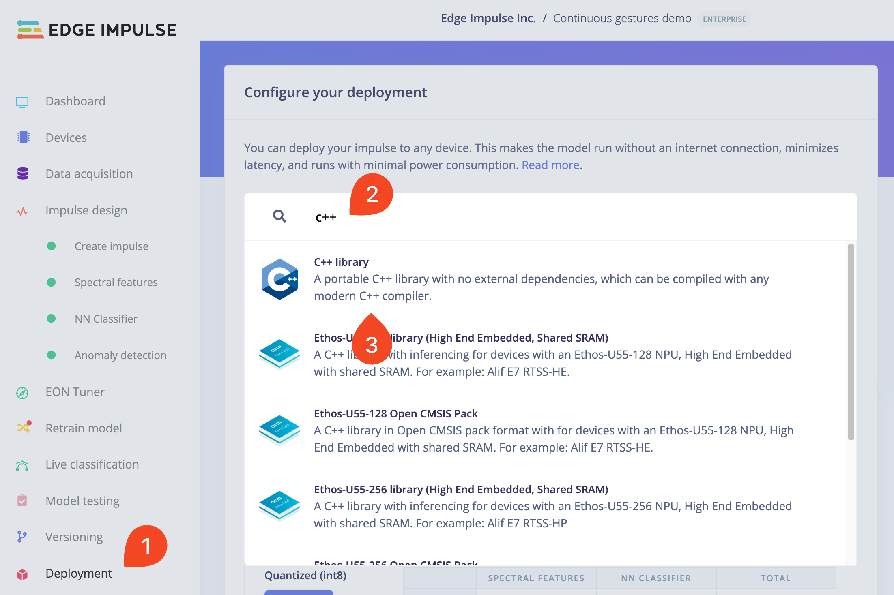
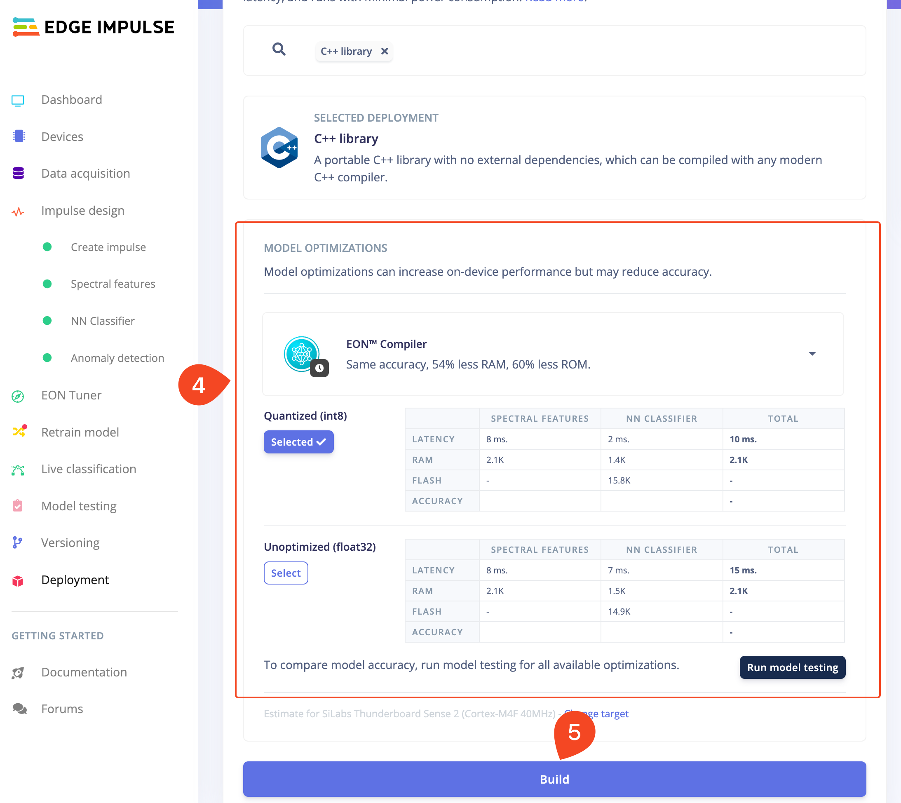

# Edge Impulse Example: standalone inferencing using Grove Vision AI Module V2 (Himax WiseEye2)

This example runs the model exported from the [Edge Impulse Studio](https://studio.edgeimpulse.com/) on the [Grove Vision AI Module V2](https://wiki.seeedstudio.com/grove_vision_ai_v2/) ([Himax WiseEye2](https://www.himax.com.tw/products/wiseeye-ai-sensing/wiseeye2-ai-processor/)). It is bare minimal source code required to run the inference using static data as an input.
The default model included in this example is motion recognition from the [Continuous motion recognition tutorial](https://docs.edgeimpulse.com/docs/tutorials/end-to-end-tutorials/continuous-motion-recognition).

To test your model using this example, you need to perform four steps: train, deploy, build firmware, and flash.

## How to train your model using Edge Impulse Studio?

To train your model, check the [end-to-end tutorials in the Edge Impulse Documentation](https://docs.edgeimpulse.com/docs/tutorials/end-to-end-tutorials). As this example uses a static (hardcoded) data, you can choose any model.

## How to deploy your model from the Edge Impulse Studio?

To deploy your model, go to the `Deployment` section (`step 1`) and then in the search field type win `c++` (`step 2`). You should see the result in the image below:



After selecting the `C++ library` deployment target (`step 3`), choose your optimization level (`step 4`), then click `Build` (`step 5`)



After downloading the zip archive, extract it. Then move the content of the archive (three directories) into `EPII_CM55M_APP_S/app/scenario_app/ei_standalone_inferencing_cmsis/ei-model` and replace the existing one.

## How to build your firmware?

1. Open the [EPII_CM55M_APP_S/makefile](../../../makefile), find the line that is setting `APP_TYPE` and change it to:
   ```
   APP_TYPE = ei_standalone_inferencing_cmsis
   ```
2. Follow the [instructions in the main README](../../../../README.md#how-to-build-the-firmware) to build the firmware

## How to flash your firmware?

The easiest approach is to use the [himax-flash-tool](https://docs.edgeimpulse.com/docs/tools/edge-impulse-cli/himax-flash-tool) which is a part of the [Edge Impulse CLI](https://docs.edgeimpulse.com/docs/tools/edge-impulse-cli) tools.
1. Install the flashtool following the instructions in the [Edge Impulse docs](https://docs.edgeimpulse.com/docs/tools/edge-impulse-cli/cli-installation)
2. Open your terminal window in the root directory of this repository
3. Run the following command
   ```bash
   himax-flash-tool -d WiseEye2 -f output_case1_sec_wlcsp/output.img
   ```

If you don't want to install the Edge Impulse CLI tools, follow the [official guide on flashing the board](../../../../README.md#how-to-flash-the-firmware)


(c) 2024 Edge Impulse Inc. All rights reserved