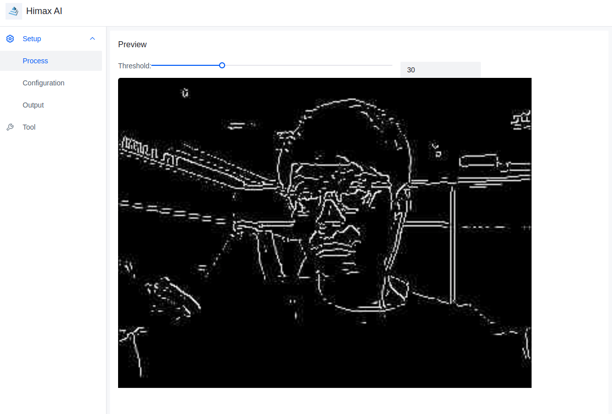

# How to add the CMSIS-CV library to project?
- This example will give the example how to add the CMSIS-CV library to project.
## Download the project with cmsis_cv library
- Please remenber git clone project with `--recursive` config to clone submodule
    ```
    git clone --recursive https://github.com/HimaxWiseEyePlus/Seeed_Grove_Vision_AI_Module_V2.git
    ```
## Step by Step to teach you how to add the CMSIS-CV library to project
1. Add the libary `cmsis_cv`, `cmsis_dsp` at the makefile of the scenario_app [here](https://github.com/HimaxWiseEyePlus/Seeed_Grove_Vision_AI_Module_V2/blob/main/EPII_CM55M_APP_S/app/scenario_app/hello_world_cmsis_cv/hello_world_cmsis_cv.mk#L20).
    ```
    LIB_SEL = pwrmgmt sensordp spi_ptl spi_eeprom hxevent img_proc cmsis_cv cmsis_dsp JPEGENC
    ```
2. Remember to check that the source codes which you want to use wheather they had been added to `LIB_CMSIS_DSP_CSRC_SUBDIR` at the [makefile of the cmsis_dsp](https://github.com/HimaxWiseEyePlus/Seeed_Grove_Vision_AI_Module_V2/blob/main/EPII_CM55M_APP_S/library/cmsis_dsp/cmsis_dsp.mk#L12) or not.
    - Please check here
        ```
        LIB_CMSIS_DSP_CSRC_SUBDIR += $(LIB_CMSIS_DSP_DIR)/Source/BasicMathFunctions \
							 $(LIB_CMSIS_DSP_DIR)/Source/StatisticsFunctions \
							 $(LIB_CMSIS_DSP_DIR)/Source/MatrixFunctions \
							 $(LIB_CMSIS_DSP_DIR)/Source/ComplexMathFunctions \
							 $(LIB_CMSIS_DSP_DIR)/Source/FastMathFunctions \
							 $(LIB_CMSIS_DSP_DIR)/Source/CommonTables \
							 $(LIB_CMSIS_DSP_DIR)/Source/TransformFunctions \
							 $(LIB_CMSIS_DSP_DIR)/Source/SupportFunctions \
							 $(LIB_CMSIS_DSP_DIR)/Source/FilteringFunctions \
        ```


## How to build hello_world_cmsis_cv scenario_app and run on WE2?
### Linux Environment
- Change the `APP_TYPE` to `hello_world_cmsis_cv` at [makefile](https://github.com/HimaxWiseEyePlus/Seeed_Grove_Vision_AI_Module_V2/blob/main/EPII_CM55M_APP_S/makefile)
    ```
    APP_TYPE = hello_world_cmsis_cv
    ```
- Build the firmware reference the part of [Build the firmware at Linux environment](https://github.com/HimaxWiseEyePlus/Seeed_Grove_Vision_AI_Module_V2?tab=readme-ov-file#build-the-firmware-at-linux-environment)

- Compile the firmware
- Generate firmware image file
- Flash the firmware to Grove Vision AI V2. You can reference the part of [Flash Image Update at Linux Environment by python code](https://github.com/HimaxWiseEyePlus/Seeed_Grove_Vision_AI_Module_V2?tab=readme-ov-file#flash-image-update-at-linux-environment-by-python-code)
- Press `reset` button on the Grove Vision AI V2.
- Press `Ctrl + c` to close the connect to terminal .
- Open the [Himax AI web toolkit](https://github.com/HimaxWiseEyePlus/Seeed_Grove_Vision_AI_Module_V2/releases/download/v1.1/Himax_AI_web_toolkit.zip) and press `connect`, you can reference [here](https://github.com/HimaxWiseEyePlus/Seeed_Grove_Vision_AI_Module_V2/blob/main/EPII_CM55M_APP_S/app/scenario_app/tflm_fd_fm/README.md#send-image-and-meta-data-by-uart) 
- This example uses cmsis-cv library to run Guassion filter or Canny Sobel feature extraction and encode to jpeg format send to PC by UART.
    - you can set the `RUN_CANNY_SOBEL_ALGO` flag to 0 or 1 at `cvapp_hello_world_cmsis_cv.cpp`. 
        ```
        RUN_CANNY_SOBEL_ALGO
        1: run the canny sobel algorithm and send the canny sobel result jpeg image out
        0: send the guassion filter result jpeg image out
        ```
    - the result will be like
        