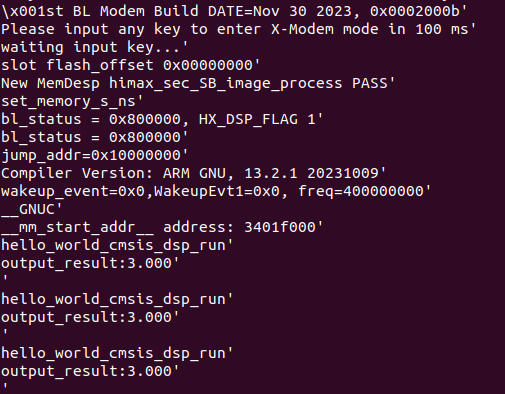

# How to add the CMSIS-DSP library to project?
- This example will give the example how to add the CMSIS-DSP library to project.

## Step by Step to teach you how to add the CMSIS-DSP library to project
1. Add the libary `cmsis_dsp` at the makefile of the scenario_app [here](https://github.com/HimaxWiseEyePlus/Seeed_Grove_Vision_AI_Module_V2/blob/main/EPII_CM55M_APP_S/app/scenario_app/hello_world_cmsis_dsp/hello_world_cmsis_dsp.mk#L19).
2. Remember to check that the source codes which you want to use wheather they had been added to `LIB_CMSIS_DSP_CSRC_SUBDIR` at the [makefile of the cmsis_dsp](https://github.com/HimaxWiseEyePlus/Seeed_Grove_Vision_AI_Module_V2/blob/main/EPII_CM55M_APP_S/library/cmsis_dsp/cmsis_dsp.mk#L12) or not.
    - StatisticsFunctions_Used: inculding the part of the source codes at the `StatisticsFunctions` folder. 
        ```
        LIB_CMSIS_DSP_CSRC_SUBDIR += $(LIB_CMSIS_DSP_DIR)/Source/BasicMathFunctions_Used \
                                    $(LIB_CMSIS_DSP_DIR)/Source/StatisticsFunctions_Used \
                                    $(LIB_CMSIS_DSP_DIR)/Source/MatrixFunctions_Used \
                                    $(LIB_CMSIS_DSP_DIR)/Source/MatrixFunctions_Used \
                                    $(LIB_CMSIS_DSP_DIR)/Source/ComplexMathFunctions_Used \
                                    $(LIB_CMSIS_DSP_DIR)/Source/FastMathFunctions_Used \
                                    $(LIB_CMSIS_DSP_DIR)/Source/CommonTables_Used \
                                    $(LIB_CMSIS_DSP_DIR)/Source/TransformFunctions_Used \
        ```


## How to build hello_world_cmsis_dsp scenario_app and run on WE2?
### Linux Environment
- Change the `APP_TYPE` to `hello_world_cmsis_dsp` at [makefile](https://github.com/HimaxWiseEyePlus/Seeed_Grove_Vision_AI_Module_V2/blob/main/EPII_CM55M_APP_S/makefile)
    ```
    APP_TYPE = hello_world_cmsis_dsp
    ```
- Build the firmware reference the part of [Build the firmware at Linux environment](https://github.com/HimaxWiseEyePlus/Seeed_Grove_Vision_AI_Module_V2?tab=readme-ov-file#build-the-firmware-at-linux-environment)

- Compile the firmware
- Generate firmware image file
- Flash the firmware to Grove Vision AI V2. You can reference the part of [Flash Image Update at Linux Environment by python code](https://github.com/HimaxWiseEyePlus/Seeed_Grove_Vision_AI_Module_V2?tab=readme-ov-file#flash-image-update-at-linux-environment-by-python-code)
- Press `reset` button on the Grove Vision AI V2, and the you will see the result on the terminal. 
    
- This example uses cmsis-dsp library to calculate the average of an array.