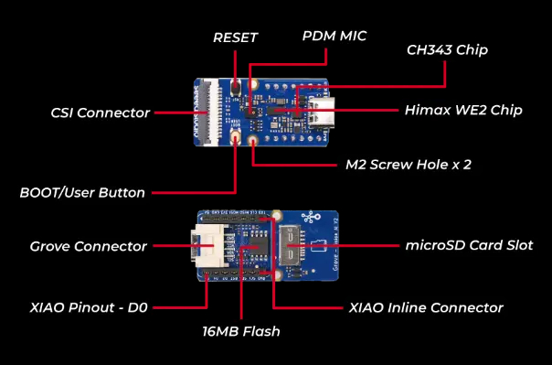

# IMU sensor data reading via I2C
- This example initializes I2C communication with the ICM42688, sets up the sensor for data reading.

## Requirements
- Grove Vision AI Module V2
    

- ICM42688 sensor board
    

- I2C connections
    

## How to build IMU Read scenario_app and run on WE2?
### Linux Environment
- Change the `APP_TYPE` to `imu_read` at [makefile](https://github.com/HimaxWiseEyePlus/Seeed_Grove_Vision_AI_Module_V2/blob/main/EPII_CM55M_APP_S/makefile)
    ```
    APP_TYPE = imu_read
    ```
- Build the firmware reference the part of [Build the firmware at Linux environment](https://github.com/HimaxWiseEyePlus/Seeed_Grove_Vision_AI_Module_V2?tab=readme-ov-file#build-the-firmware-at-linux-environment)

- Compile the firmware
- Generate firmware image file
- Flash the firmware to Grove Vision AI V2

## Run IMU Read scenario_app
- Read 3-axis gyroscope and a 3-axis accelerometer data from ICM42688.
    
