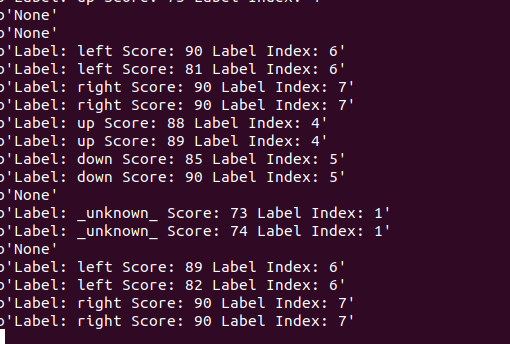

# KeyWord Spotting using Transformers

KeyWord Spotting (KWS) is a technique used to detect specific words within a stream of audio data, typically in low-power, always-on settings. This `scenario_app` utilizes ARM's [KeyWord Transformer](https://www.isca-archive.org/interspeech_2021/berg21_interspeech.pdf) model to perform KWS on the Grove Vision AI v2 board.

The audio data preprocessing is inspired by ARM's [ml-embedded-evaluation_kit](https://review.mlplatform.org/plugins/gitiles/ml/ethos-u/ml-embedded-evaluation-kit/+/refs/tags/22.02/docs/use_cases/kws.md), which involves converting raw audio into MFCC features as shown below [reference here](https://review.mlplatform.org/plugins/gitiles/ml/ethos-u/ml-embedded-evaluation-kit/+/refs/heads/main/docs/media/KWS_preprocessing.png):


## Download the Project by Cloning This Repository

- To ensure all submodules are cloned, use the `--recursive` flag:
    ```bash
    git clone --recursive https://github.com/HimaxWiseEyePlus/Seeed_Grove_Vision_AI_Module_V2.git
    ```

## Building the `kws_pdm_record` Scenario App and Running it on WE2

### Linux Environment

1. Change the `APP_TYPE` to `kws_pdm_record` in the [Makefile](https://github.com/HimaxWiseEyePlus/Seeed_Grove_Vision_AI_Module_V2/blob/main/EPII_CM55M_APP_S/makefile):
    ```makefile
    APP_TYPE = kws_pdm_record
    ```

2. Build the firmware. Refer to the section on [Building the Firmware in a Linux Environment](https://github.com/HimaxWiseEyePlus/Seeed_Grove_Vision_AI_Module_V2?tab=readme-ov-file#build-the-firmware-at-linux-environment) for details.

3. Compile the firmware and generate the firmware image file.

4. Flash the firmware to the Grove Vision AI v2. For instructions, see [Flashing Image Updates in a Linux Environment Using Python](https://github.com/HimaxWiseEyePlus/Seeed_Grove_Vision_AI_Module_V2?tab=readme-ov-file#flash-image-update-at-linux-environment-by-python-code). Currently, the model is stored at flash address `0x3AB7B000`. Use the following command to flash the firmware image to the board:

    ```bash
    python3 xmodem/xmodem_send.py --port=/dev/ttyACM0 --baudrate=921600 --protocol=xmodem --file=we2_image_gen_local/output_case1_sec_wlcsp/output.img --model="model_zoo/kws_pdm_record/kwt1_relu_mfcc_fvp_aligned_vela.tflite 0xB7B000 0x00000"
    ```

5. Press the `reset` button on the Grove Vision AI V2.

6. You should now see the KeyWord Spotting application running in your terminal.


