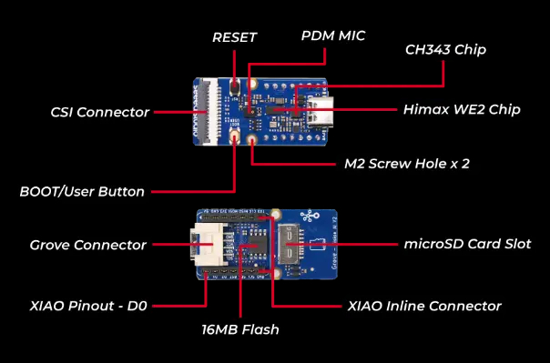
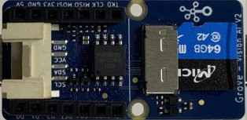
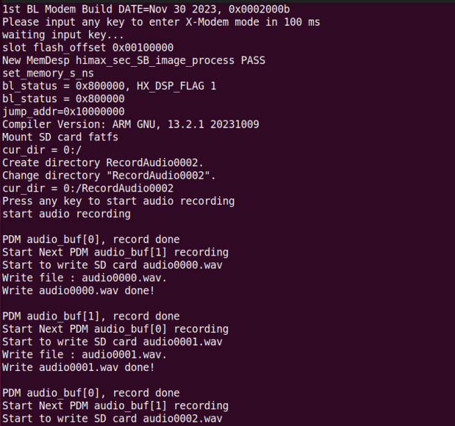
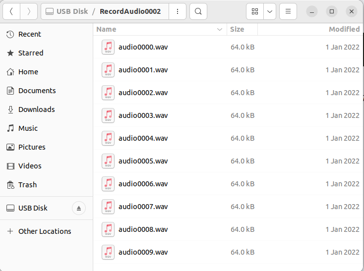

# Record PDM audio and save to SD card wav files
- This example will use the PDM MIC to record audio and save the audio to an SD card wav file.
  
## Requirements
- Grove Vision AI Module V2
    
- SD Card
  
    


## How to build PDM Record scenario_app and run on WE2?
### Linux Environment
- Change the `APP_TYPE` to `pdm_record` at [makefile](https://github.com/HimaxWiseEyePlus/Seeed_Grove_Vision_AI_Module_V2/blob/main/EPII_CM55M_APP_S/makefile)
    ```
    APP_TYPE = pdm_record
    ```
- Build the firmware reference the part of [Build the firmware at Linux environment](https://github.com/HimaxWiseEyePlus/Seeed_Grove_Vision_AI_Module_V2?tab=readme-ov-file#build-the-firmware-at-linux-environment)

- Compile the firmware
- Generate firmware image file
- Flash the firmware to Grove Vision AI V2

## Run PDM Record scenario_app
- Run pdm_record application and press any key to start recording
    

## Save audio pcm in SD card
- Waveform Audio File Format(WAV)
- Sampling rate 16K Hz
- mono
- 16 bits per sample
  
    