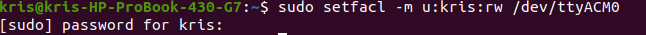
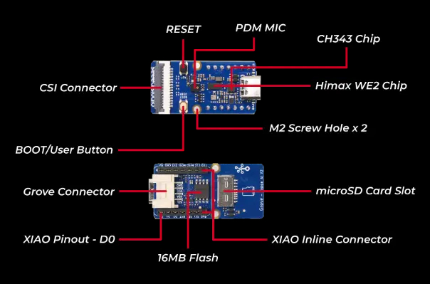
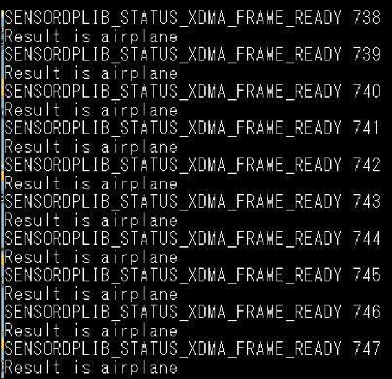

## How to build mobilenet classification scenario_app and run on WE2?
- This is a example model which is converted from pytorch using [TinyNeuralNetwork](https://github.com/HimaxWiseEyePlus/TinyNeuralNetwork) to tflite. You can reference the converted example at [TinyNeuralNetwork_Convert_Example](https://github.com/HimaxWiseEyePlus/TinyNeuralNetwork_Convert_Example).
### Linux Environment
- Change the `APP_TYPE` to `tflm_mb_cls` at [makefile](https://github.com/HimaxWiseEyePlus/Seeed_Grove_Vision_AI_Module_V2/blob/main/EPII_CM55M_APP_S/makefile)
    ```
    APP_TYPE = tflm_mb_cls
    ```
- Build the firmware reference the part of [Build the firmware at Linux environment](https://github.com/HimaxWiseEyePlus/Seeed_Grove_Vision_AI_Module_V2?tab=readme-ov-file#build-the-firmware-at-linux-environment)
- How to flash firmware image and model at [model_zoo](https://github.com/HimaxWiseEyePlus/Seeed_Grove_Vision_AI_Module_V2/tree/main/model_zoo)?
  - Prerequisites for xmodem
    - Please install the package at [xmodem/requirements.txt](https://github.com/HimaxWiseEyePlus/Seeed_Grove_Vision_AI_Module_V2/tree/main/xmodem/requirements.txt) 
        ```
        pip install -r xmodem/requirements.txt
        ```
  - Disconnect `Minicom`
  - Make sure your `Seeed Grove Vision AI Module V2` is connect to PC.
  - Open the permissions to acceess the deivce
    ```
    sudo setfacl -m u:[USERNAME]:rw /dev/ttyUSB0
    # in my case
    # sudo setfacl -m u:kris:rw /dev/ttyACM0
    ```
    
  - Open `Terminal` and key-in following command
    - port: the COM number of your `Seeed Grove Vision AI Module V2`, for example,`/dev/ttyACM0`
    - baudrate: 921600
    - file: your firmware image [maximum size is 1MB]
    - model: you can burn multiple models "[model tflite] [position of model on flash] [offset]"
      - Position of model on flash is defined at [~/tflm_mb_cls/common_config.h](https://github.com/HimaxWiseEyePlus/Seeed_Grove_Vision_AI_Module_V2/blob/main/EPII_CM55M_APP_S/app/scenario_app/tflm_mb_cls/common_config.h#L27)
        ```
        python3 xmodem/xmodem_send.py --port=[your COM number] --baudrate=921600 --protocol=xmodem --file=we2_image_gen_local/output_case1_sec_wlcsp/output.img --model="model_zoo/tflm_mb_cls/qat_puring_model_vela.tflite 0xB7B000 0x00000"

        # example:
        # python3 xmodem/xmodem_send.py --port=/dev/ttyACM0 --baudrate=921600 --protocol=xmodem --file=we2_image_gen_local/output_case1_sec_wlcsp/output.img --model="model_zoo/tflm_mb_cls/qat_puring_model_vela.tflite 0xB7B000 0x00000"
        ```
    - It will start to burn firmware image and model automatically.
  -  Please press `reset` buttun on `Seeed Grove Vision AI Module V2`.
     
  - It will success to run the algorithm.

[Back to Outline](https://github.com/HimaxWiseEyePlus/Seeed_Grove_Vision_AI_Module_V2?tab=readme-ov-file#outline)

### Windows Environment
- Change the `APP_TYPE` to `tflm_mb_cls` at [makefile](https://github.com/HimaxWiseEyePlus/Seeed_Grove_Vision_AI_Module_V2/blob/main/EPII_CM55M_APP_S/makefile)
    ```
    APP_TYPE = tflm_mb_cls
    ```
- Build the firmware reference the part of [Build the firmware at Windows environment](https://github.com/HimaxWiseEyePlus/Seeed_Grove_Vision_AI_Module_V2?tab=readme-ov-file#build-the-firmware-at-windows-environment)
- How to flash firmware image and model at [model_zoo](https://github.com/HimaxWiseEyePlus/Seeed_Grove_Vision_AI_Module_V2/tree/main/model_zoo)?
  - Prerequisites for xmodem
    - Please install the package at [xmodem/requirements.txt](https://github.com/HimaxWiseEyePlus/Seeed_Grove_Vision_AI_Module_V2/tree/main/xmodem/requirements.txt) 
        ```
        pip install -r xmodem/requirements.txt
        ```
  - Disconnect `Tera Term`
  - Make sure your `Seeed Grove Vision AI Module V2` is connect to PC.
  - Open `CMD` and key-in following command
    - port: the COM number of your `Seeed Grove Vision AI Module V2` 
    - baudrate: 921600
    - file: your firmware image [maximum size is 1MB]
    - model: you can burn multiple models "[model tflite] [position of model on flash] [offset]"
      - Position of model on flash is defined at [~/tflm_mb_cls/common_config.h](https://github.com/HimaxWiseEyePlus/Seeed_Grove_Vision_AI_Module_V2/blob/main/EPII_CM55M_APP_S/app/scenario_app/tflm_mb_cls/common_config.h#L27)
        ```
        python xmodem\xmodem_send.py --port=[your COM number] --baudrate=921600 --protocol=xmodem --file=we2_image_gen_local\output_case1_sec_wlcsp\output.img --model="model_zoo\tflm_mb_cls\qat_puring_model_vela.tflite 0xB7B000 0x00000"

        # example:
        # python xmodem\xmodem_send.py --port=COM123 --baudrate=921600 --protocol=xmodem --file=we2_image_gen_local\output_case1_sec_wlcsp\output.img --model="model_zoo\tflm_mb_cls\qat_puring_model_vela.tflite 0xB7B000 0x00000"
        ```
    - It will start to burn firmware image and model automatically.
  -  Please press `reset` buttun on `Seeed Grove Vision AI Module V2`.
      
  - It will success to run the algorithm.


[Back to Outline](https://github.com/HimaxWiseEyePlus/Seeed_Grove_Vision_AI_Module_V2?tab=readme-ov-file#outline)

### Classification result
- You can see the classification result by minicom or Tera Term
- This model is trained by cifar10 dataset.
- The cifar10_labels are [`airplane`, `automobile`, `bird`, `cat`, `deer`, `dog`, `frog`, `horse`, `ship`, `truck`]



[Back to Outline](https://github.com/HimaxWiseEyePlus/Seeed_Grove_Vision_AI_Module_V2?tab=readme-ov-file#outline)

### Model source link
- [Model converted example by TinyNeuralNetwork](https://github.com/HimaxWiseEyePlus/TinyNeuralNetwork_Convert_Example)

[Back to Outline](https://github.com/HimaxWiseEyePlus/Seeed_Grove_Vision_AI_Module_V2?tab=readme-ov-file#outline)