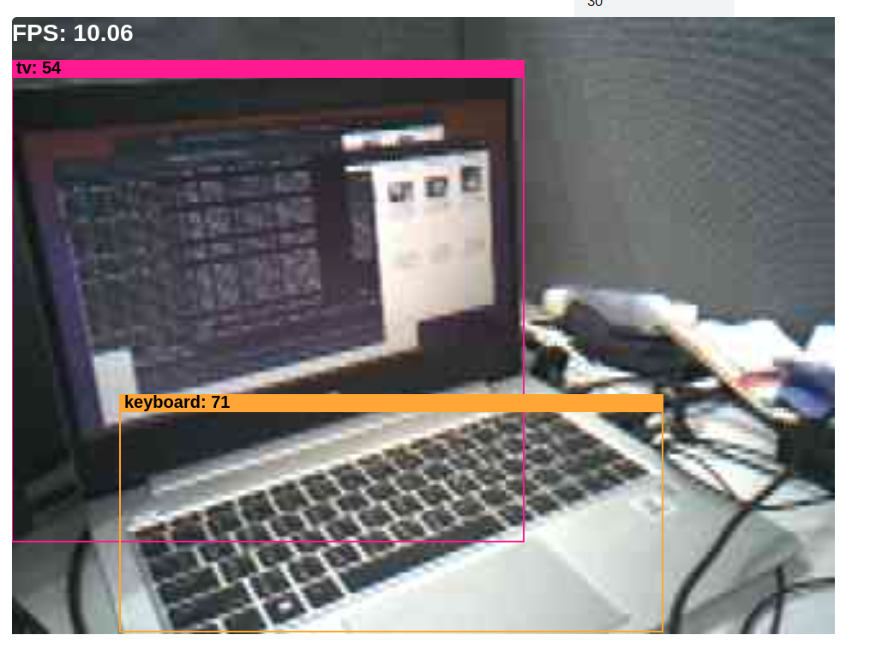

## How to build yolo11n object detection scenario_app and run on WE2?
### Linux Environment
- Change the `APP_TYPE` to `tflm_yolo11_od` at [makefile](https://github.com/HimaxWiseEyePlus/Seeed_Grove_Vision_AI_Module_V2/blob/main/EPII_CM55M_APP_S/makefile)
    ```
    APP_TYPE = tflm_yolo11_od
    ```
- We will perform some of the post-processing in the C code to reduce the tensor arena usage in TFLite. If you want to run the full yolo11n object detection TFlite with full post-proccessing on TFlite. You can modify the define to be `0` at [here](https://github.com/HimaxWiseEyePlus/Seeed_Grove_Vision_AI_Module_V2/blob/main/EPII_CM55M_APP_S/app/scenario_app/tflm_yolo11_od/cvapp_yolo11n_ob.cpp#L38).
  ```
  #define YOLO11_NO_POST_SEPARATE_OUTPUT 1
  ```
- Build the firmware reference the part of [Build the firmware at Linux environment](https://github.com/HimaxWiseEyePlus/Seeed_Grove_Vision_AI_Module_V2?tab=readme-ov-file#build-the-firmware-at-linux-environment)
- How to flash firmware image and model at [model_zoo](https://github.com/HimaxWiseEyePlus/Seeed_Grove_Vision_AI_Module_V2/tree/main/model_zoo)?
  - Prerequisites for xmodem
    - Please install the package at [xmodem/requirements.txt](https://github.com/HimaxWiseEyePlus/Seeed_Grove_Vision_AI_Module_V2/tree/main/xmodem/requirements.txt) 
        ```
        pip install -r xmodem/requirements.txt
        ```
  - Disconnect `Minicom`
  - Make sure your `Seeed Grove Vision AI Module V2` is connect to PC.
  - Open the permissions to acceess the deivce
    ```
    sudo setfacl -m u:[USERNAME]:rw /dev/ttyUSB0
    # in my case
    # sudo setfacl -m u:kris:rw /dev/ttyACM0
    ```
    
  - Open `Terminal` and key-in following command
    - port: the COM number of your `Seeed Grove Vision AI Module V2`, for example,`/dev/ttyACM0`
    - baudrate: 921600
    - file: your firmware image [maximum size is 1MB]
    - model: you can burn multiple models "[model tflite] [position of model on flash] [offset]"
      - Position of model on flash is defined at [~/tflm_yolo11_od/common_config.h](https://github.com/HimaxWiseEyePlus/Seeed_Grove_Vision_AI_Module_V2/blob/main/EPII_CM55M_APP_S/app/scenario_app/tflm_yolo11_od/common_config.h#L27)
        ```
        python3 xmodem/xmodem_send.py --port=[your COM number] --baudrate=921600 --protocol=xmodem --file=we2_image_gen_local/output_case1_sec_wlcsp/output.img --model="model_zoo/tflm_yolo11_od/yolo11n_full_integer_quant_vela_imgz_224_kris_nopost_241230.tflite 0xB7B000 0x00000"

        # example:
        # python3 xmodem/xmodem_send.py --port=/dev/ttyACM0 --baudrate=921600 --protocol=xmodem --file=we2_image_gen_local/output_case1_sec_wlcsp/output.img --model="model_zoo/tflm_yolo11_od/yolo11n_full_integer_quant_vela_imgz_224_kris_nopost_241230.tflite 0xB7B000 0x00000"
        ```
      - If you want to run the tflite with full post-proccessing. You should burn the model, `model_zoo/tflm_yolo11_od/yolo11n_full_integer_quant_192_241219_batch_matmul_vela.tflite`, at [here](https://github.com/HimaxWiseEyePlus/Seeed_Grove_Vision_AI_Module_V2/blob/main/model_zoo/tflm_yolo11_od/yolo11n_full_integer_quant_192_241219_batch_matmul_vela.tflite).
    - It will start to burn firmware image and model automatically.
  -  Please press `reset` buttun on `Seeed Grove Vision AI Module V2`.
     
  - It will success to run the algorithm.

[Back to Outline](https://github.com/HimaxWiseEyePlus/Seeed_Grove_Vision_AI_Module_V2?tab=readme-ov-file#outline)

### Windows Environment
- Change the `APP_TYPE` to `tflm_yolo11_od` at [makefile](https://github.com/HimaxWiseEyePlus/Seeed_Grove_Vision_AI_Module_V2/blob/main/EPII_CM55M_APP_S/makefile)
    ```
    APP_TYPE = tflm_yolo11_od
    ```
- We will perform some of the post-processing in the C code to reduce the tensor arena usage in TFLite. If you want to run the full yolo11n object detection TFlite with full post-proccessing on TFlite. You can modify the define to be `0` at [here](https://github.com/HimaxWiseEyePlus/Seeed_Grove_Vision_AI_Module_V2/blob/main/EPII_CM55M_APP_S/app/scenario_app/tflm_yolo11_od/cvapp_yolo11n_ob.cpp#L38).
  ```
  #define YOLO11_NO_POST_SEPARATE_OUTPUT 1
  ```
- Build the firmware reference the part of [Build the firmware at Windows environment](https://github.com/HimaxWiseEyePlus/Seeed_Grove_Vision_AI_Module_V2?tab=readme-ov-file#build-the-firmware-at-windows-environment)
- How to flash firmware image and model at [model_zoo](https://github.com/HimaxWiseEyePlus/Seeed_Grove_Vision_AI_Module_V2/tree/main/model_zoo)?
  - Prerequisites for xmodem
    - Please install the package at [xmodem/requirements.txt](https://github.com/HimaxWiseEyePlus/Seeed_Grove_Vision_AI_Module_V2/tree/main/xmodem/requirements.txt) 
        ```
        pip install -r xmodem/requirements.txt
        ```
  - Disconnect `Tera Term`
  - Make sure your `Seeed Grove Vision AI Module V2` is connect to PC.
  - Open `CMD` and key-in following command
    - port: the COM number of your `Seeed Grove Vision AI Module V2` 
    - baudrate: 921600
    - file: your firmware image [maximum size is 1MB]
    - model: you can burn multiple models "[model tflite] [position of model on flash] [offset]"
      - Position of model on flash is defined at [~/tflm_yolo11_od/common_config.h](https://github.com/HimaxWiseEyePlus/Seeed_Grove_Vision_AI_Module_V2/blob/main/EPII_CM55M_APP_S/app/scenario_app/tflm_yolo11_od/common_config.h#L27)
        ```
        python xmodem\xmodem_send.py --port=[your COM number] --baudrate=921600 --protocol=xmodem --file=we2_image_gen_local\output_case1_sec_wlcsp\output.img --model="model_zoo\tflm_yolo11_od\yolo11n_full_integer_quant_vela_imgz_224_kris_nopost_241230.tflite 0xB7B000 0x00000"

        # example:
        # python xmodem\xmodem_send.py --port=COM123 --baudrate=921600 --protocol=xmodem --file=we2_image_gen_local\output_case1_sec_wlcsp\output.img --model="model_zoo\tflm_yolo11_od\yolo11n_full_integer_quant_vela_imgz_224_kris_nopost_241230.tflite 0xB7B000 0x00000"
        ```

      - If you want to run the tflite with full post-proccessing. You should burn the model, `model_zoo/tflm_yolo11_od/yolo11n_full_integer_quant_192_241219_batch_matmul_vela.tflite`, at [here](https://github.com/HimaxWiseEyePlus/Seeed_Grove_Vision_AI_Module_V2/blob/main/model_zoo/tflm_yolo11_od/yolo11n_full_integer_quant_192_241219_batch_matmul_vela.tflite).
    - It will start to burn firmware image and model automatically.
  -  Please press `reset` buttun on `Seeed Grove Vision AI Module V2`.
      
  - It will success to run the algorithm.


[Back to Outline](https://github.com/HimaxWiseEyePlus/Seeed_Grove_Vision_AI_Module_V2?tab=readme-ov-file#outline)

### Send image and meta data by UART
- Disconnect the uart at your `Tera Term` or `Minicom` first.
- You can use the [Himax AI web toolkit](https://github.com/HimaxWiseEyePlus/Seeed_Grove_Vision_AI_Module_V2/releases/download/v1.1/Himax_AI_web_toolkit.zip) which we provide, download it and unzip it to local PC, and double click `index.html`.
- Please check you select `Grove Vision AI(V2)` and press `connect` button
    
- Select your own COM.
    
- You will see the preview result on website.
- Tip
    - Windows:
        - Please use "Microsoft Edge" browser
    - Linux:
        - Open the permissions to acceess the deivce
            ```
            sudo setfacl -m u:[USERNAME]:rw /dev/ttyUSB0
            # in my case
            # sudo setfacl -m u:kris:rw /dev/ttyACM0
            ```
        - Please use "Google Chrome" browser
          
[Back to Outline](https://github.com/HimaxWiseEyePlus/Seeed_Grove_Vision_AI_Module_V2?tab=readme-ov-file#outline)

### Model source link
- [Yolo11n object detection](https://github.com/HimaxWiseEyePlus/YOLO11_on_WE2?tab=readme-ov-file#yolo11n-object-detection)

[Back to Outline](https://github.com/HimaxWiseEyePlus/Seeed_Grove_Vision_AI_Module_V2?tab=readme-ov-file#outline)