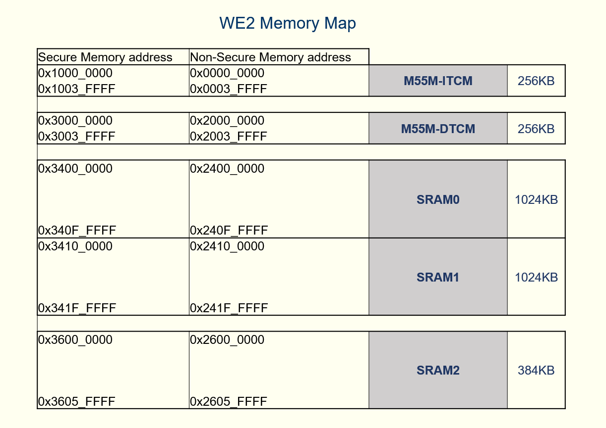

# FAQ :
### 1. How to find the device memory map ?
The following table refers to the memory mapping information specific to the Himax HX6538.
    

### 2. Can we decide where to place the model for the tflm_fd_fm example in Flash?
Yes. The address of the model is defined in the following file and you can modify it yourself. The model starting address should be 4KB aligned.
And the model should be placed after address 0x200000, as the first 2MB of addresses are reserved for the firmware.
https://github.com/HimaxWiseEyePlus/Seeed_Grove_Vision_AI_Module_V2/blob/main/EPII_CM55M_APP_S/app/scenario_app/tflm_fd_fm/common_config.h
If you want to integrate a different model and put it in flash, you can define your model starting address in common_config.h and burn the model file into the FLASH.