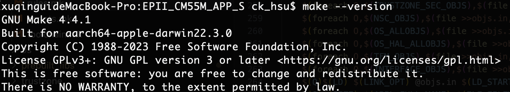
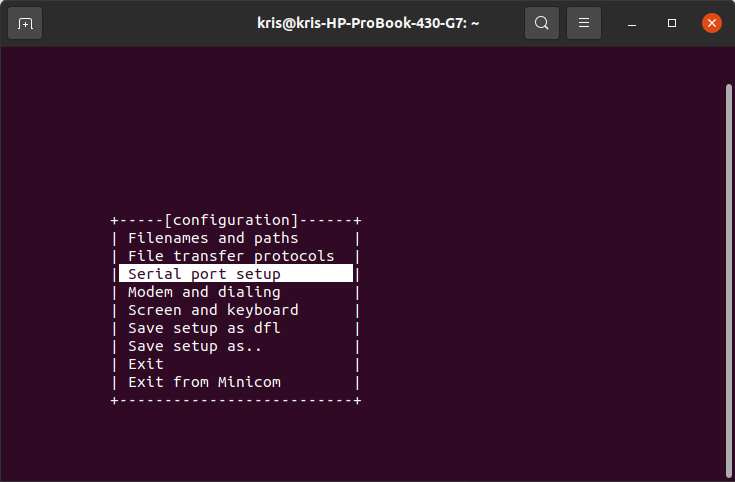

# Himax yolo11n examples for Seeed Grove Vision AI Module V2

## In short

This repo helps you get YOLO11 object detection running on the board: you can flash a ready-made image that detects hornets or build and flash your own. The [Grove Vision AI Module V2 (GV2)](https://www.kiwi-electronics.com/nl/grove-vision-ai-module-v2-20039) is a tiny onboard computer (MCU) connected to a [small camera](https://www.tinytronics.nl/en/sensors/optical/cameras-and-scanners/raspberry-pi-compatible-camera-5mp-v1.3), and it runs AI on the device; **output.img** is a ready-made software image for it that detects Yellow-legged hornets, European hornets, wasps and bees. It can be **flashed** (= copying that image onto the board) so it runs the hornet detection AI.

## Contents

- [Quick start: flash the ready-made image](#quick-start-flash-the-ready-made-image)
- [Build and flash your own YOLO11 image](#build-and-flash-your-own-yolo11-image)
- [Outline](#outline) (detailed build, flash, restore, and more)

---

## Quick start: flash the ready-made image

Use this path if you want to flash the device with a pre-built YOLO11 image and do not need to build from source.

1. **Clone this repository** and switch to the branch that provides the image:
  ```
  git clone --recursive --branch yolo11-vespa https://github.com/marcory-hub/Seeed_Grove_Vision_AI_Module_V2.git
  cd Seeed_Grove_Vision_AI_Module_V2
  ```
2. **Get the ready-made image.**
  If `we2_image_gen_local/output_case1_sec_wlcsp/output.img` is not in your clone, download it and place it there:
  - [output.img](https://github.com/marcory-hub/Seeed_Grove_Vision_AI_Module_V2/raw/yolo11-vespa/we2_image_gen_local/output_case1_sec_wlcsp/output.img)
3. **Prepare your system.**
  If the device is not recognised, install the driver (see [System Requirement](#system-requirement) below. Connect the Grove Vision AI Module V2 via USB. Install the xmodem helper (as in the original [Flash Image Update by python code](#flash-image-update-at-linux-environment-by-python-code) section):
4. **Flash the image.**
  Use the COM port assigned to your device (e.g. `/dev/ttyACM0` on Linux or `COM3` on Windows). Example (Linux/macOS):
   On Windows, use `python` and backslashes, e.g. `--file=we2_image_gen_local\output_case1_sec_wlcsp\output.img`.  
   When prompted, press the **reset** button on the module (as in the original flash section). More options (serial setup, COM port tips, minicom/teraterm) are under [How to flash the firmware?](#how-to-flash-the-firmware) and [System Requirement](#system-requirement) below.

---

## Build and flash your own YOLO11 image

If you have trained, quantized, and converted your own YOLO11n model (see instructions and Colab notebooks [here](https://github.com/marcory-hub/yolo11n-on-grove-vision-ai-v2)), ensure your `.tflite` file meets the following specifications:
- **Model Input Shape:** Use Netron to open the YOLO11n model file and check that the structure matches the following:
  
 
1. **Put your model in the model zoo.**
  Place your `.tflite` file in the appropriate folder under `model_zoo` (same path convention as in the original; see scenario [tflm_yolo11_od](https://github.com/HimaxWiseEyePlus/Seeed_Grove_Vision_AI_Module_V2/blob/main/EPII_CM55M_APP_S/app/scenario_app/tflm_yolo11_od/README.md) in the Outline table below).
2. **Build and flash.**
  Follow [How to build the firmware?](#how-to-build-the-firmware) (original section below) for your OS, then [How to flash the firmware?](#how-to-flash-the-firmware). The flash section describes the optional `--model` argument (model path and flash addresses) when burning a custom model (see original lines 247–253 Linux, 280–286 Windows).

---

# Himax examples for Seeed Grove Vision AI Module V2

## Outline

This is a repository which step by step teaches you how to build your own examples and run on Seeed Grove Vision AI Module V2.
Finally, teach you how to restore to the original factory settings and run [SenseCraft AI](https://wiki.seeedstudio.com/grove_vision_ai_v2_software_support/#-no-code-getting-started-with-sensecraft-ai-) from [Seeed Studio](https://wiki.seeedstudio.com/grove_vision_ai_v2/).

# Himax examples for Seeed Grove Vision AI Module V2

## Outline

- How to build the firmware?
  - [Build the firmware at Linux environment](https://github.com/HimaxWiseEyePlus/Seeed_Grove_Vision_AI_Module_V2?tab=readme-ov-file#build-the-firmware-at-linux-environment)
  - [Build the firmware at MacOS environment](https://github.com/HimaxWiseEyePlus/Seeed_Grove_Vision_AI_Module_V2?tab=readme-ov-file#build-the-firmware-at-macos-environment)
  - [Build the firmware at Windows environment](https://github.com/HimaxWiseEyePlus/Seeed_Grove_Vision_AI_Module_V2?tab=readme-ov-file#build-the-firmware-at-windows-environment)
- How to flash the firmware?
  - [System Requirement](https://github.com/HimaxWiseEyePlus/Seeed_Grove_Vision_AI_Module_V2?tab=readme-ov-file#system-requirement)
  - [Flash Image Update at Linux Environment by python code](https://github.com/HimaxWiseEyePlus/Seeed_Grove_Vision_AI_Module_V2?tab=readme-ov-file#flash-image-update-at-linux-environment-by-python-code)
  - [Flash Image Update at Windows Environment by python code](https://github.com/HimaxWiseEyePlus/Seeed_Grove_Vision_AI_Module_V2?tab=readme-ov-file#flash-image-update-at-windows-environment-by-python-code)
  - [Flash Image Update at Linux Environment](https://github.com/HimaxWiseEyePlus/Seeed_Grove_Vision_AI_Module_V2?tab=readme-ov-file#flash-image-update-at-linux-environment)
  - [Flash Image Update at Windows Environment](https://github.com/HimaxWiseEyePlus/Seeed_Grove_Vision_AI_Module_V2?tab=readme-ov-file#flash-image-update-at-windows-environment)
  - [Flash using Edge Impulse CLI tools](https://github.com/HimaxWiseEyePlus/Seeed_Grove_Vision_AI_Module_V2?tab=readme-ov-file#flash-using-edge-impulse-cli-tools)
- How to restore to the original factory settings?
  - [Linux Environment](https://github.com/HimaxWiseEyePlus/Seeed_Grove_Vision_AI_Module_V2?tab=readme-ov-file#linux-environment)
  - [Windows Environment](https://github.com/HimaxWiseEyePlus/Seeed_Grove_Vision_AI_Module_V2?tab=readme-ov-file#windows-environment)

| scenario_app                                 | project name                                                                                                                                                               |
| -------------------------------------------- | -------------------------------------------------------------------------------------------------------------------------------------------------------------------------- |
| face mesh                                    | [tflm_fd_fm](https://github.com/HimaxWiseEyePlus/Seeed_Grove_Vision_AI_Module_V2/blob/main/EPII_CM55M_APP_S/app/scenario_app/tflm_fd_fm/README.md)                         |
| yolov8n object detection                     | [tflm_yolov8_od](https://github.com/HimaxWiseEyePlus/Seeed_Grove_Vision_AI_Module_V2/blob/main/EPII_CM55M_APP_S/app/scenario_app/tflm_yolov8_od/README.md)                 |
| yolov8n pose                                 | [tflm_yolov8_pose](https://github.com/HimaxWiseEyePlus/Seeed_Grove_Vision_AI_Module_V2/blob/main/EPII_CM55M_APP_S/app/scenario_app/tflm_yolov8_pose/README.md)             |
| yolov8n gender classification                | [tflm_yolov8_gender_cls](https://github.com/HimaxWiseEyePlus/Seeed_Grove_Vision_AI_Module_V2/blob/main/EPII_CM55M_APP_S/app/scenario_app/tflm_yolov8_gender_cls/README.md) |
| pdm mic record                               | [pdm_record](https://github.com/HimaxWiseEyePlus/Seeed_Grove_Vision_AI_Module_V2/blob/main/EPII_CM55M_APP_S/app/scenario_app/pdm_record/README.md)                         |
| KeyWord Spotting using Transformers          | [kws_pdm_record](https://github.com/HimaxWiseEyePlus/Seeed_Grove_Vision_AI_Module_V2/blob/main/EPII_CM55M_APP_S/app/scenario_app/kws_pdm_record/README.md)                 |
| imu read                                     | [imu_read](https://github.com/HimaxWiseEyePlus/Seeed_Grove_Vision_AI_Module_V2/blob/main/EPII_CM55M_APP_S/app/scenario_app/imu_read/README.md)                             |
| peoplenet from TAO                           | [tflm_peoplenet](https://github.com/HimaxWiseEyePlus/Seeed_Grove_Vision_AI_Module_V2/blob/main/EPII_CM55M_APP_S/app/scenario_app/tflm_peoplenet/README.md)                 |
| yolo11n object detection                     | [tflm_yolo11_od](https://github.com/HimaxWiseEyePlus/Seeed_Grove_Vision_AI_Module_V2/blob/main/EPII_CM55M_APP_S/app/scenario_app/tflm_yolo11_od/README.md)                 |
| mobilenet classification converted by TinyNN | [tflm_mb_cls](https://github.com/HimaxWiseEyePlus/Seeed_Grove_Vision_AI_Module_V2/blob/main/EPII_CM55M_APP_S/app/scenario_app/tflm_mb_cls/README.md)                       |
| mobilenetV2 classification using ExecuTorch  | [torch_mb_cls](https://github.com/HimaxWiseEyePlus/Seeed_Grove_Vision_AI_Module_V2/blob/main/EPII_CM55M_APP_S/app/scenario_app/torch_mb_cls/README.md)                    |


- [How to add support for raspberry pi camera?](https://github.com/HimaxWiseEyePlus/Seeed_Grove_Vision_AI_Module_V2?tab=readme-ov-file#how-to-add-support-for-raspberry-pi-camera)
- [How to use CMSIS-NN at the project?](https://github.com/HimaxWiseEyePlus/Seeed_Grove_Vision_AI_Module_V2?tab=readme-ov-file#how-to-use-cmsis-nn-at-the-project)
- [How to use CMSIS-DSP at the project?](https://github.com/HimaxWiseEyePlus/Seeed_Grove_Vision_AI_Module_V2/blob/main/EPII_CM55M_APP_S/app/scenario_app/hello_world_cmsis_dsp/README.md)
- [How to use CMSIS-CV at the project?](https://github.com/HimaxWiseEyePlus/Seeed_Grove_Vision_AI_Module_V2/blob/main/EPII_CM55M_APP_S/app/scenario_app/hello_world_cmsis_cv/README.md)
  - please clone the project by following command to download CMSIS-CV library
- How to run Edge Impulse Example: standalone inferencing using Grove Vision AI Module V2 (Himax WiseEye2)? 
  - [ei_standalone_inferencing](https://github.com/HimaxWiseEyePlus/Seeed_Grove_Vision_AI_Module_V2/tree/main/EPII_CM55M_APP_S/app/scenario_app/ei_standalone_inferencing)
  - [ei_standalone_inferencing_camera](https://github.com/HimaxWiseEyePlus/Seeed_Grove_Vision_AI_Module_V2/tree/main/EPII_CM55M_APP_S/app/scenario_app/ei_standalone_inferencing_camera)
- [FAQ](https://github.com/HimaxWiseEyePlus/Seeed_Grove_Vision_AI_Module_V2/blob/main/FAQ.md)

## How to build the firmware?

This part explains how you can build the firmware for Grove Vision AI Module V2.

### Build the firmware at Linux environment

Note: The following has been tested to work on Ubuntu 20.04 PC

- Step 1: Install the following prerequisites
- Step 2: Download Arm GNU Toolchain (arm-gnu-toolchain-13.2.rel1-x86_64-arm-none-eabi.tar.xz)
- Step 3: Extract the file
- Step 4: Add arm-gnu-toolchain-13.2.Rel1-x86_64-arm-none-eabi/bin/: to PATH  
  (hint: the path about [$HOME/arm-gnu-toolchain-13.2.Rel1-x86_64-arm-none-eabi/bin/] should set your own path, you can not just copy and paste)
- Step 5: Clone the following repository and go into Seeed_Grove_Vision_AI_Module_V2 folder
- Step 6: Compile the firmware
- Output elf file: `./obj_epii_evb_icv30_bdv10/gnu_epii_evb_WLCSP65/EPII_CM55M_gnu_epii_evb_WLCSP65_s.elf`
  alt text
- Step 7: Generate firmware image file
- Output firmware image: `./output_case1_sec_wlcsp/output.img`
  alt text

[Back to Outline](https://github.com/HimaxWiseEyePlus/Seeed_Grove_Vision_AI_Module_V2?tab=readme-ov-file#outline)

### Build the firmware at MacOS environment

Note: The steps are almost the same as the [Linux environment](https://github.com/HimaxWiseEyePlus/Seeed_Grove_Vision_AI_Module_V2?tab=readme-ov-file#build-the-firmware-at-linux-environment) except `Step 1` and `Step 7`.

- Step 1: 
  - You should make sure your `make` is using `GNU version make` not `BSD version make`.
      
  - If it is not `GNU make` , you should download it by following command.
  - After installation, you can access it with the command gmake to avoid conflicts with the default make.
  - So, you should create an alias in your shell configuration file (like .bash_profile or .zshrc):
- Step 7: Generate firmware image file (using `./we2_local_image_gen_macOS_arm64` for MacOS)
  [Back to Outline](https://github.com/HimaxWiseEyePlus/Seeed_Grove_Vision_AI_Module_V2?tab=readme-ov-file#outline)

### Build the firmware at Windows environment

- Step 1: Install the `make` command for prerequisites , you can reference [here](https://github.com/xpack-dev-tools/windows-build-tools-xpack/releases)
- Step 2: Download Arm GNU Toolchain [arm-gnu-toolchain-13.2.rel1-mingw-w64-i686-arm-none-eabi.zip](https://developer.arm.com/-/media/Files/downloads/gnu/13.2.rel1/binrel/arm-gnu-toolchain-13.2.rel1-mingw-w64-i686-arm-none-eabi.zip?rev=93fda279901c4c0299e03e5c4899b51f&hash=A3C5FF788BE90810E121091C873E3532336C8D46)
- Step 3: Extract the file
- Step 4: Add arm-gnu-toolchain-13.2.rel1-mingw-w64-i686-arm-none-eabi/bin/ to your environment variables 
  - option1: add the gnu-toolchain to your environment variables manually
  - option2: add the gnu-toolchain by command
  (hint: the path about [location of your gnu-toolchain-13.2 ROOT] should set your own path, you can not just copy and paste)
- Step 5: Clone the following repository and go into Seeed_Grove_Vision_AI_Module_V2 folder
- Step 6: Compile the firmware
- Output elf file: `./obj_epii_evb_icv30_bdv10/gnu_epii_evb_WLCSP65/EPII_CM55M_gnu_epii_evb_WLCSP65_s.elf`
  alt text
- Step 7: Generate firmware image file
- Output firmware image: `./output_case1_sec_wlcsp/output.img`
  alt text

[Back to Outline](https://github.com/HimaxWiseEyePlus/Seeed_Grove_Vision_AI_Module_V2?tab=readme-ov-file#outline)

## How to flash the firmware?

This part explains how you can flash the firmware to Grove Vision AI Module V2.

### System Requirement

- Driver
  - If you find that the Grove Vision AI V2 is not recognised after connecting it to your computer, you should install the driver which can reference [here](https://wiki.seeedstudio.com/grove_vision_ai_v2/#driver).

1. Grove Vision AI Module V2
2. Connection cable
  - Micro usb cable: connect to EVB (as Power/UART)
3. Software Tools
  Serial terminal emulation application
  - In the following description, `TeraTerm` and `Minicom` will be used.
    - Serial terminal emulation application Setting
      - Baud Rate 921600 bps
      - Data        8 bit
      - Parity        none
      - Stop        1 bit
      - Flow control    none
      - please check xmodem protocol is supported.
    - Minicom (for Linux PC)
      - Install minicom command
      - Burn application to flash by using xmodem send application binary.
        - Minicom will extra install "lrzsz" package to support xmodem protocol
          alt text
        - If you did not have “lrzsz” instruction, please install by following instruction.
      - Open the permissions to access the device
          
      - Open minicom
          
      - Setup serial port and COM Port name
        alt text
        - Tips for finding the COM Port name.
          - You can use google chrome to connect to [Seeed SenseCraft AI](https://seeed-studio.github.io/SenseCraft-Web-Toolkit/#/setup/process), select `Grove Vision(V2)` and press `Connect`.
          alt text
          - Then, you would get the COM Port name.
          alt text
    - TeraTerm (for Windows PC)
      - Setup serial port 
        alt text
        alt text

[Back to Outline](https://github.com/HimaxWiseEyePlus/Seeed_Grove_Vision_AI_Module_V2?tab=readme-ov-file#outline)

### Flash Image Update at Linux Environment by python code

- Prerequisites for xmodem
  - Please install the package at [xmodem/requirements.txt](https://github.com/HimaxWiseEyePlus/Seeed_Grove_Vision_AI_Module_V2/tree/main/xmodem/requirements.txt) 
- Disconnect `Minicom`
- Make sure your `Seeed Grove Vision AI Module V2` is connect to PC.
- Open the permissions to acceess the deivce

```
sudo setfacl -m u:[USERNAME]:rw /dev/ttyUSB0
# in my case
# sudo setfacl -m u:kris:rw /dev/ttyACM0
```

alt text

- Open `Terminal` and key-in following command
- port: the COM number of your `Seeed Grove Vision AI Module V2`, for example,`/dev/ttyACM0`
- baudrate: 921600
- file: your firmware image [maximum size is 1MB]
- model(optional): you can burn multiple models "[model tflite] [position of model on flash] [offset]"
  - Position of model on flash is defined at the code [~/tflm_yolov8_od/common_config.h](https://github.com/HimaxWiseEyePlus/Seeed_Grove_Vision_AI_Module_V2/blob/main/EPII_CM55M_APP_S/app/scenario_app/tflm_yolov8_od/common_config.h#L27) (take [tflm_yolov8_od](https://github.com/HimaxWiseEyePlus/Seeed_Grove_Vision_AI_Module_V2/blob/main/EPII_CM55M_APP_S/app/scenario_app/tflm_yolov8_od/README.md) for example)
- It will start to burn firmware image.
  alt text
- Please press `reset` buttun on `Seeed Grove Vision AI Module V2`.
  alt text
- It will success to run the algorithm.

[Back to Outline](https://github.com/HimaxWiseEyePlus/Seeed_Grove_Vision_AI_Module_V2?tab=readme-ov-file#outline)

### Flash Image Update at Windows Environment by python code

- Prerequisites for xmodem
  - Please install the package at [xmodem/requirements.txt](https://github.com/HimaxWiseEyePlus/Seeed_Grove_Vision_AI_Module_V2/tree/main/xmodem/requirements.txt) 
- Disconnect `Tera Term`
- Make sure your `Seeed Grove Vision AI Module V2` is connect to PC.
- Open `CMD` and key-in following command
- port: the COM number of your `Seeed Grove Vision AI Module V2` 
- baudrate: 921600
- file: your firmware image [maximum size is 1MB]
- model: you can burn multiple models "[model tflite] [position of model on flash] [offset]"
  - Position of model on flash is defined at the code [~/tflm_yolov8_od/common_config.h](https://github.com/HimaxWiseEyePlus/Seeed_Grove_Vision_AI_Module_V2/blob/main/EPII_CM55M_APP_S/app/scenario_app/tflm_yolov8_od/common_config.h#L27) (take [tflm_yolov8_od](https://github.com/HimaxWiseEyePlus/Seeed_Grove_Vision_AI_Module_V2/blob/main/EPII_CM55M_APP_S/app/scenario_app/tflm_yolov8_od/README.md) for example)
- It will start to burn firmware image automatically.
  alt text
- Please press `reset` buttun on `Seeed Grove Vision AI Module V2`.
alt text  
- It will success to run the algorithm.

[Back to Outline](https://github.com/HimaxWiseEyePlus/Seeed_Grove_Vision_AI_Module_V2?tab=readme-ov-file#outline)

### Flash Image Update at Linux Environment

Following steps update application in the flash.

- Step 1: Open `Minicom`, setup serial port and COM Port name-> connect to Grove Vision AI Module V2. (Please reference the minicom part of [System Requirement](https://github.com/HimaxWiseEyePlus/Seeed_Grove_Vision_AI_Module_V2?tab=readme-ov-file#system-requirement))
  alt text
- Step 2: Hold down any key on the keyboard (except the Enter key) and press the reset button to reset Grove Vision AI Module V2 and the startup options will be displayed.
  alt text
- Step 3: Press button “1” and Grove Vision AI Module V2 will enter receiving mode after then.  
  alt text
- Step 4: Press `Ctrl+A` on keyboard to enter minicom menu, and then press `s` on keyboard to upload file and select `xmodem`. 
  alt text
- Step 5: Select the firmware image at `Seeed_Grove_Vision_AI_Module_V2\we2_image_gen_local\output_case1_sec_wlcsp\output.img` and press `enter` to burn. 
  alt text
- Step 6: After burning is compelete, press any key to be continue. 
  alt text
- Step 7: Then, you will see the message "Do you want to end file transmission and reboot system? (y)" is displayed. Press button `y` to restart.
  alt text
- Step 8: You will see the uart on `minicom` which is runing your algorithm.
  alt text

[Back to Outline](https://github.com/HimaxWiseEyePlus/Seeed_Grove_Vision_AI_Module_V2?tab=readme-ov-file#outline)

### Flash Image Update at Windows Environment

Following steps update application in the flash.

- Step 1: Open `TeraTerm` and select File -> New connection, connect to Grove Vision AI Module V2.
  alt text
- Step 2: Hold down any key on the keyboard (except the Enter key) and press the reset button to reset Grove Vision AI Module V2 and the startup options will be displayed.
  alt text
- Step 3: Press button “1” and Grove Vision AI Module V2 will enter receiving mode after then. Select target flash image(output.img) by File->Transfer->XMODEM->Send. 
  alt text
- Step 4: After the firmware image burning is completed, the message "Do you want to end file transmission and reboot system? (y)" is displayed. Press button `y` to restart.
  alt text
- Step 5: You will see the uart on `TeraTerm` which is runing your algorithm.
  alt text

[Back to Outline](https://github.com/HimaxWiseEyePlus/Seeed_Grove_Vision_AI_Module_V2?tab=readme-ov-file#outline)

### Flash using Edge Impulse CLI tools

This method works on all supported operating systems (Windows/Linux/MacOS...)

- Step 1: [Install the Edge Impulse CLI tools](https://docs.edgeimpulse.com/docs/tools/edge-impulse-cli/cli-installation)
- Step 2: Open any system terminal and run the following command
  ```
  himax-flash-tool -d WiseEye2 -f <path_to_four_firmware_img_file>
  ```
- Step 3: Wait until you see the following message:
  ```
  [HMX] Press **RESET** to start the application...
  [HMX] Firmware update completed
  ```

Note: if the flashing process hangs, just cancel it (Ctrl+C) and start once again.

[Back to Outline](#outline)

## How to restore to the original factory settings

### Linux Environment

- Update the flash image `Seeed_SenseCraft_AI*.img` to Grove Vision AI Module V2 and press `reset` buttun.
  alt text
- Disconnect the `Minicom`:
  - Please press `Ctrl+A` on keyboard and press `z` on keyboard to go to the menu of `minicom`.
    alt text
  - Then, press `q` on keyboard to quit with no reset `minicom`, and press `yes` to leave.
    alt text
- Open the permissions to acceess the deivce
  ```
  sudo setfacl -m u:[USERNAME]:rw /dev/ttyUSB0
  # in my case
  # sudo setfacl -m u:kris:rw /dev/ttyACM0
  ```
  
- After doing the above steps, you can run the [SenseCraft AI](https://wiki.seeedstudio.com/grove_vision_ai_v2_software_support/#-no-code-getting-started-with-sensecraft-ai-) on Grove Vision AI Module V2.
  1. Introduction : [https://wiki.seeedstudio.com/grove_vision_ai_v2/](https://wiki.seeedstudio.com/grove_vision_ai_v2/)
  2. Connect Grove Vision AI Module to NB USB port
  3. Open "Google Chrome" browser
  4. Open [SenseCraft Homepage](https://seeed-studio.github.io/SenseCraft-Web-Toolkit/#/setup/process)
  5. Select "Grove Vision AI(WE2)" and connect (serial port)
    alt text
    alt text
    alt text

[Back to Outline](https://github.com/HimaxWiseEyePlus/Seeed_Grove_Vision_AI_Module_V2?tab=readme-ov-file#outline)

### Windows Environment

- Update the flash image `Seeed_SenseCraft AI*.img` to Grove Vision AI Module V2 and press `reset` buttun.
  alt text
- Disconnect the `TeraTerm`.
  alt text
- After doing the above steps, you can run the [SenseCraft AI](https://wiki.seeedstudio.com/grove_vision_ai_v2_software_support/#-no-code-getting-started-with-sensecraft-ai-) on Grove Vision AI Module V2.
  1. Introduction : [https://wiki.seeedstudio.com/grove_vision_ai_v2/](https://wiki.seeedstudio.com/grove_vision_ai_v2/)
  2. Install CH343 UART driver (CH343SER.ZIP) (Optional)
  3. Connect Grove Vision AI Module to NB USB port
  4. Open "Microsoft Edge" browser
  5. Open [SenseCraft Homepage](https://seeed-studio.github.io/SenseCraft-Web-Toolkit/#/setup/process)
  6. Select "Grove Vision AI(WE2)" and connect (serial port)

[Back to Outline](https://github.com/HimaxWiseEyePlus/Seeed_Grove_Vision_AI_Module_V2?tab=readme-ov-file#outline)

## How to add support for raspberry pi camera?

You can reference the scenario app [allon_sensor_tflm](https://github.com/HimaxWiseEyePlus/Seeed_Grove_Vision_AI_Module_V2/tree/main/EPII_CM55M_APP_S/app/scenario_app/allon_sensor_tflm) , [allon_sensor_tflm_freertos](https://github.com/HimaxWiseEyePlus/Seeed_Grove_Vision_AI_Module_V2/tree/main/EPII_CM55M_APP_S/app/scenario_app/allon_sensor_tflm_freertos) and [tflm_fd_fm](https://github.com/HimaxWiseEyePlus/Seeed_Grove_Vision_AI_Module_V2/tree/main/EPII_CM55M_APP_S/app/scenario_app/tflm_fd_fm).
Take allon_sensor_tflm for example, you should only modify the [allon_sensor_tflm.mk](https://github.com/HimaxWiseEyePlus/Seeed_Grove_Vision_AI_Module_V2/blob/main/EPII_CM55M_APP_S/app/scenario_app/allon_sensor_tflm/allon_sensor_tflm.mk#L37) from cis_ov5647 to cis_imx219 or cis_imx477.

```
#CIS_SUPPORT_INAPP_MODEL = cis_ov5647
CIS_SUPPORT_INAPP_MODEL = cis_imx219
#CIS_SUPPORT_INAPP_MODEL = cis_imx477
```

So that, it can support cis_imx219 or cis_imx477 camera.

[Back to Outline](https://github.com/HimaxWiseEyePlus/Seeed_Grove_Vision_AI_Module_V2?tab=readme-ov-file#outline)

## How to use CMSIS-NN at the project?

- Modify the setting at the [makefile](https://github.com/HimaxWiseEyePlus/Seeed_Grove_Vision_AI_Module_V2/blob/main/EPII_CM55M_APP_S/makefile)
  - Enable the flag `LIB_CMSIS_NN_ENALBE` to build CMSIS-NN library 
  - You can reference the scenario app example about [allon_sensor_tflm_cmsis_nn](https://github.com/HimaxWiseEyePlus/Seeed_Grove_Vision_AI_Module_V2/tree/main/EPII_CM55M_APP_S/app/scenario_app/allon_sensor_tflm_cmsis_nn) which is the example running the model without passing vela and using the CMSIS-NN library.
    - Change the `APP_TYPE` to `allon_sensor_tflm_cmsis_nn` at the [makefile](https://github.com/HimaxWiseEyePlus/Seeed_Grove_Vision_AI_Module_V2/blob/main/EPII_CM55M_APP_S/makefile)

**YOLO11n Model Specifications:**  
- Input resolution: 224x224  
- Quantization: Vela, no_post-activation quantization applied

[Back to Outline](https://github.com/HimaxWiseEyePlus/Seeed_Grove_Vision_AI_Module_V2?tab=readme-ov-file#outline)