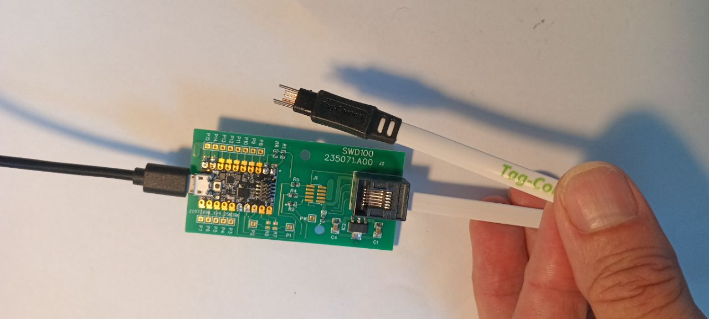
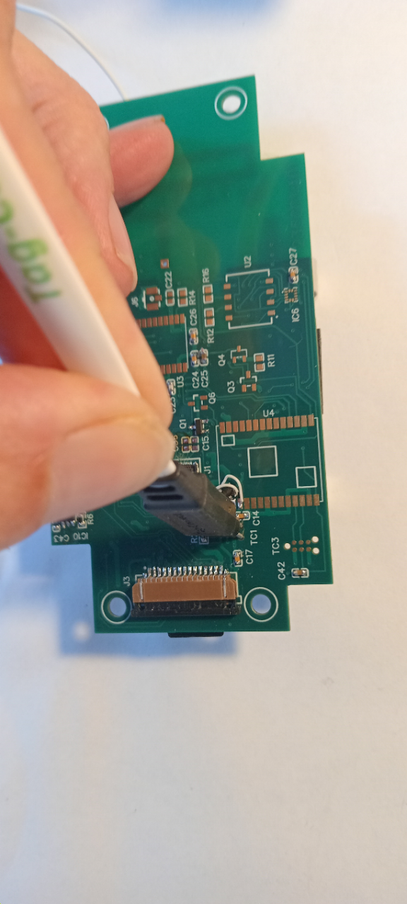
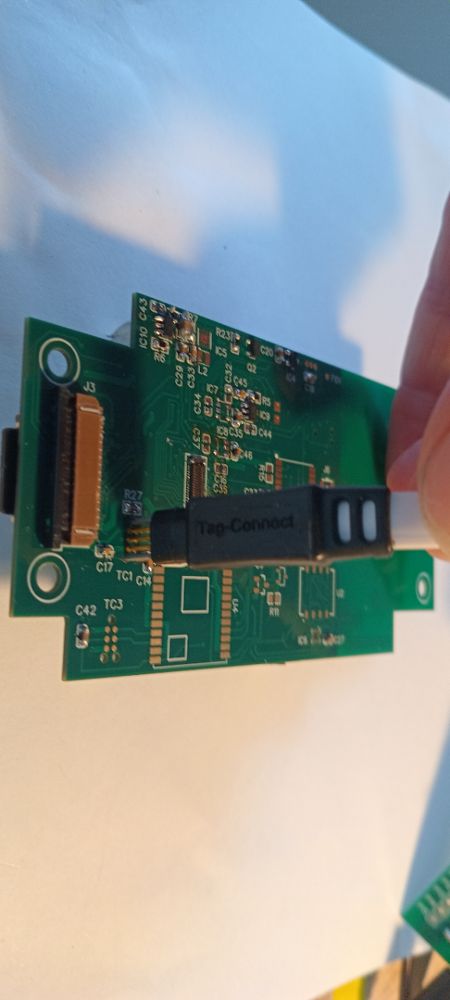

# SWD100 Programmer and Debug Board
#### CGP 23/4/25

## Rationale

It is necessary to program the WW500 with a [bootloader](bootloader.md). This is necessary 
the very first time a board is manufactured, as there is no software at all in the HX6538
AI processor chip. It is also necessary when changing the bootloader, 
for example to the DPD bootloader (see below).

ARM processors make use of a [Serial Wire Debug (SWD)](https://docs.px4.io/v1.12/en/debug/swd_debug.html)
port to program memory in their chips, and also to debug code (single-step through an instruction sequence).

Himax describe the use of the [SWD port for debugging](https://github.com/HimaxWiseEyePlus/Seeed_Grove_Vision_AI_Module_V2/blob/main/swd_debugging/README.md).
The approach decribed by Himax uses a programmer that I did not have, and did not want to buy.
The also use a different connector to connect the programmer to the target board(the Grove Vision AI V2).
I considered the options available to me - these are discussed in section 5 of the 
[Compiling and Flashing images](Compile_and_flash.md) document.

The approach that worked involved using a [MAX32625PICO](https://os.mbed.com/platforms/MAX32625PICO/)
 module with a lashed-together cable assembly. The MAX32625PICO is also documented [here.](https://www.analog.com/en/resources/evaluation-hardware-and-software/evaluation-boards-kits/max32625pico.html#eb-overview)
 
While this approach worked, it was likely to become unstable, and it could not be replicated by
anyone else. So I decided to design a clean solution. This is a new PCB - the SWD100 - on which I solder
a MAX32625PICO module. It provides a simple way to connect to the WW500.

## Overview of the SW100

This is a simple board designed to operate as a OpenOCD programmer. It has these attributes:

* Based on [MAX32625PICO Programmable Interface Controller](https://os.mbed.com/platforms/MAX32625PICO/?form=MG0AV3)
* Connector for the [TC2030-MCP-NL](https://www.tag-connect.com/product/tc2030-mcp-nl-6-pin-no-legs-cable-with-rj12-modular-plug-for-microchip-icd) 
 6-Pin No-Legs Cable with RJ12 Modular Plug from Tag Connect
* Option to power the target from two AA batteries.
* Option to power the board from the 5V from the USB connector (using a 3.3V LDO regulator).

The assembled SWD100 is shown below.
 

I use the TC2030 interface on all of my boards. This is a zero-cost option on the boards as
no connector is used. Instead the baords have a pattern of six bare pads that make contact with the 
spring-loaded terminals of the TC2030.
See here for the [TC2030 Datasheet](https://www.tag-connect.com/wp-content/uploads/bsk-pdf-manager/2022/06/TC2030-MCP.pdf) for TC2030
 
## Using the SWD100 to program WW500 boards

The images below provide two views of the SWD100 connecting to the WW500. There are three footprints for the TC2030 on the WW500:
1. TC1 is for the HX6538.
2. TC2 is for the MKL62BA
3. TC3 is for the radar module, if we ever use one.

 
 

You need to prepare software tools as described in section 5 of the [Compiling and Flashing images](Compile_and_flash.md) document.

You can the program the bootloader firmware image into the WW50 using section 6 of that document.

(Later I might merge that document with this one...)

## HX6538 Bootloaders

A bootloader is software that runs as soon as a processor is reset (e.g. powered up) 
and when the application code (written by us - called the "application) begins to execute. 
Amongst its other tasks is to allow for the opportunity to install a different application.

The HX6538 is available with a standard boot loader. When I asked Himax about minimising 
power consumption (by placing the chip into deep power-down mode, DPD) they indicated 
that they would supply is with a different bootloader. That is the "DPD Bootloader".

This has been supplied and tested.

There is a reference to how using the DPD bootloader is different , in the Compile_and_flash.md documentation.

## Use with nRF52832 and Eclipse

I use a different SWD programmer to program the bootloader into the MKL62BA - the BLE and LoRaWAN module
on the WW500. It should be possible to use the SWD100 to program the MKL62BA as well. I am not sure whether I have
done this yet or not. However, I am recording here where I got to with enquiries:

Copilot says this:

>> Yes, you can use the MAX32625PICO as an SWD programmer for nRF52832 boards. The MAX32625PICO is a versatile development tool that includes a CMSIS-DAP debug probe, which is compatible with the SWD interface used by the nRF52832. This means you can use it to program and debug your nRF52832 boards.
>> 
>> To set it up, you'll need to connect the SWDIO, SWDCLK, GND, and VCC pins from the MAX32625PICO to the corresponding pins on your nRF52832 board. The MAX32625PICO supports adaptable signal voltage, so it can interface with systems that use 1.8V to 3.3V signaling.

Then:

To use the MAX32625PICO as an SWD programmer for nRF52832 boards with `nrfutils` from within Eclipse, you'll need to configure the MAX32625PICO as a CMSIS-DAP debug probe. Here are the steps to set it up:

### 1. Connect the MAX32625PICO to the nRF52832 Board:
- **SWDIO**: Connect to the SWDIO pin on the nRF52832.
- **SWDCLK**: Connect to the SWDCLK pin on the nRF52832.
- **GND**: Connect to the ground pin on the nRF52832.
- **VCC**: Connect to the VCC pin on the nRF52832 (ensure the voltage levels match).

### 2. Install the Required Software:
- **nrfutils**: Ensure you have `nrfutils` installed on your system.
- **CMSIS-DAP Drivers**: Install the necessary drivers for the MAX32625PICO to function as a CMSIS-DAP debug probe. You can find the drivers and firmware updates [here](https://os.mbed.com/platforms/MAX32625PICO/).

### 3. Configure Eclipse:
- **Open Eclipse**: Launch Eclipse and open your project.
- **Debug Configuration**: Go to `Run` > `Debug Configurations`.
- **Create a New Configuration**: Create a new debug configuration for your project.
- **Select Debugger**: Choose the CMSIS-DAP debugger option.
- **Set Device**: Set the target device to nRF52832.
- **Set Interface**: Ensure the interface is set to SWD.

### 4. Flash and Debug:
- **Build Project**: Build your project in Eclipse.
- **Flash Firmware**: Use `nrfutils` to flash the firmware to the nRF52832 board via the MAX32625PICO.
- **Debug**: Start the debug session in Eclipse to program and debug your nRF52832 board.

#### Drivers

I asked about the "drivers":

Yes, I am referring to drivers that you need to install on your laptop. Since you are using Windows, you will need to install the CMSIS-DAP drivers for the MAX32625PICO to function as a debug probe. Here are the steps to install the necessary drivers:

1. **Download the CMSIS-DAP Drivers**:
   - Visit the [MAX32625PICO page](https://os.mbed.com/platforms/MAX32625PICO/) on the Mbed website.
   - Download the CMSIS-DAP drivers for Windows.

2. **Install the Drivers**:
   - Run the downloaded installer and follow the on-screen instructions to install the drivers on your laptop.

3. **Verify the Installation**:
   - Connect the MAX32625PICO to your laptop via USB.
   - Open the Device Manager on your Windows laptop.
   - Check that the MAX32625PICO is recognized under "Universal Serial Bus devices" or "Ports (COM & LPT)".

Once the drivers are installed, you should be able to use the MAX32625PICO as an SWD programmer for your nRF52832 boards with `nrfutils` from within Eclipse.

I found a [mbedWinSerial_16466.exe]() driver then asked Copilot to confirm:

Yes, that sounds right! The `mbedWinSerial_16466.exe` file is the installer for the mbed Windows serial port driver. This driver is necessary for Windows to recognize the serial port of mbed-enabled devices, including the MAX32625PICO.

To install the driver:
1. **Download the Installer**: Ensure you have the `mbedWinSerial_16466.exe` file on your computer.
2. **Run the Installer**: With your MAX32625PICO connected to your computer, run the installer. Follow the on-screen instructions to complete the installation.
3. **Verify Installation**: After installation, check the Device Manager to ensure that the MAX32625PICO is recognized under "Ports (COM & LPT)" or "Universal Serial Bus devices".

This should enable your MAX32625PICO to function as a CMSIS-DAP debug probe for programming and debugging your nRF52832 boards.

#### Other Links

* x [MAX32625PICO FIRMWARE IMAGES](https://github.com/analogdevicesinc/max32625pico-firmware-images)
* y [Windows serial configuration](https://os.mbed.com/handbook/Windows-serial-configuration)
* Something [here](https://os.mbed.com/docs/mbed-os/v6.16/debug-test/eclipse.html)
about Eclipse, including openOCD

