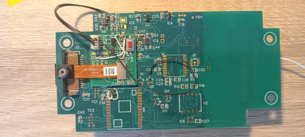

# Changes to WW500.A01 to use HM0360 Image Sensor for Motion Detection
#### CGP 14/3/25

Himax made some recomendations on changing the circuit so that the HM0360 would operate to
wake the HX6538 from deep power down (DPD). These are documented in [Wildlife.ai WW500 Circuit
Modification](images/WW500_Circuit_Modification_20250227.pdf) of Feb 25, 2025. These changes are summarised below.

Key elements are:
* HM0360 should be always-on (so it can detect motion while the HX6538 is in deep power down (DPD) mode.
* Because the HX6538 does not provide a clock to the HM0360 while in DPD, the HM0360 should be set to 
operate with an internal oscillator.
 

## WW500ADT Adapter Board

On that basis, because I did not want to make delicate changes by hand on 5 boards, and also because I wanted to test
some additional "wake from sleep" circuitry before committing to a Rev B00 board, I decided to make a small adapter PCB.

The adapter PCB is called "WW500ADPT".

The [WW500ADPT schematic](images/SCH_235050.A00.pdf) shows it has a male and female connector
and some logic gates.

WW500ADPT PCB artwork is shown here:

 
 

The WW500ADPT plugs onto the WW500 in place of the HM0360 module, and the HM0360 plugs onto the connector
on the top of the adapter. Most signals connect straight through on the adapter, but not all: 
the necessary corrections are made.

The 4-way connector allows a cable assembly (documented below) to get 3.3V power from the WW500 J4 connector,
and routes a wakeup signal to the right place on the WW500.A01

The assembled WW500ADPT is shown below, assembled on the WW500 with the HM0360.

 

## 4-Way Cable Assembly

A cable assembly takes 3V3 and GND from the main WW500 PCB (3V3 is not present on the HM0360 connector).

It delivers the (active high) WAKE signal from the WW500ADPT to the WW500 track currently labelled as /WAKE.
 This connects to the HX6538 PA0 pin and is used to wake that processor from deep power down (DPD).
 
After assembling the system I realised I could make further changes so that the /WAKE output from the MKL62BA 
could be routed to the WW500ADPT and routed through the NAND/NOR gates so it can also drive the PA0 WAKE pin,
and so wake the HX6538.
 

| WW500ADPT pin | WW500ADPT signal  | WW500 Connection     | Notes                |
| --------------|-------------------|----------------------|----------------------|
| 1             | GND               | GND                  | Via unmodified cable |
| 2             | 3V3               | 3V3                  | Via unmodified cable |
| 3             | Wire to /BLE_WAKE | /WAKE (from MKL62BA) | Cut cable and solder at Q6 site (drain). |
| 4             | WAKE              | /WAKE (to HX6538 PA0)| Cut cable and solder at Q1 site (drain). |

Manual PCB changes:

* Q1 is removed from the WW500 and wire 4 is soldered to the Q1 drain pad (which connects to PA0).
* Q6 is not populated on the WW500. Wire 3 is soldered to the Q6 drain pad (which connects to MKL62BA /WAKE output).
* The /WAKE track between Q1 and Q6 is cut.

## Himax Instructions of 11/3/25

Himax emailed these instructions:

```
You should make the following circuit changes to your existing PCB.

1. 1V8_WE/3V3_WE switch capacitor : C43, C44 -> 1nF
2. Add a level-shifting circuit from SEN_INT to PA0 (without inverter)
3. Add p.u to SEN_SCL & SEN_SDA
4. HM0360 2V8 always on
5. HM0360 XSLEEP/XSHDN should be pull-high (always on)
6. WE2 SEN_XSLEEP/SEN_GPIO/SEN_MCLK should be NC (You can lift the SEN_XSLEEP, SEN_GPIO, and SEN_MCLK pins on the WE2)
7. HM0360 CLK_SEL/MCLK connect to DGND (OSC mode)
```

Instruction 1 needs to be made by changing components on the WW500. 
Instructions 2-7 are handled by the WW500ADPT PCB.

## PCB Clearance Issues

In designing the WW500ADPT I overlooked how low profile the 30-way connectors are (0.5mm).
In contrast the ICs and capacitors are c. 1mm, so the connectors don't mate.

Solution:

* Depopulate IC7, IC8, C15, C16, C32, C36, C34, C37 (there are equivalent decoupler capacitors on the WW500ADPT)
* Move IC7 (1V8 regulator) to U4 pins 1, 2 & 3
* Move IC8 (2V8 regulator) to WW500ADPT

These modifications can be seen in the photo above.

## Software

Himax have provided software to test the HM0360 motion detection on the WW500.

[It is a available on Github](https://github.com/stevehuang82/for_wildlife_ai/tree/main/allon_sensor_tflm_freertos)

I have made a number of enhancements to this, including:
* Introducing colour (via printf_x.c & .h) which makes it easier to follow progress.
* Removed the cause of some compiler warnings.
* Stopped PB11 being initialised as an SPI signal (it is the inter-processor communications interrupt on the WW500).
* Added code to explore HM0360 register settings, especially for motion detection. (Work in progress). HM0360 settings can be loaded from a file.
* Added code to enter DPD if the HM0360 is missing, and allows operation to continue if the SD card is missing. This allows low power to be measured.  

The Himax Github location also provides a document on how the HM0360 is used for motion detection:
[HM0360 Motion Detection Setting](https://github.com/stevehuang82/for_wildlife_ai/blob/main/doc/HM0360_Motion_Detection_Setting_20250306.pdf)

The WW500 must use a different bootloader - to support DPD. This is available [here](https://github.com/stevehuang82/for_wildlife_ai/tree/main/we2_image_gen_local_dpd)

Changing the bootloader requires a programmer that accesses the SWD port, at TC1 on the WW500. The process is described in the 
[Compile_and_flash](Compile_and_flash.md) document. To make this more convenient I have also designed the SWD100 debugger.
This is a DAPLink programmer that connects by USB cable to a laptop and to the WW500 via spring-loaded pins. Details to follow. 

When the software is a bit more stable I will offer it to Himax, in case some of the changes are useful for others. 
(I will push my development branch, which includes this document, to Github, so if you are reading this the modified code 
will already be there, in the `Seeed_Grove_Vision_AI_Module_V2\EPII_CM55M_APP_S\app\ww_projects\allon_sensor_tflm_freertos` folder).

## Results

Once the hardware changes have been made and the software installed, the device operates as intended: 

After cold boot the HM0360 is initialised and takes a number of photos which are stored on the SD card. 
The WW500 then enters DPD mode. 

If the camera is pointing into the room then almost immediately the HM0360 detects motion and wakes the WW500. The HX6538
performs a warm boot, and takes more photos. The process repeats.

I find that if I place the WW500 with the HM0360 face down on my desk then motion is not detected until I move the WW500.

One of the software modifications is to detect if the HM0360 is absent and to enter DPD immediately. This allows testing without the inconvenience 
of the motion detection waking the HX6538. Another change allows the program to run when no SD card is present. 
This allows the SD card power to be removed from the total when evaluating the DPD power.

I added a switch on the WW500ADPT, which wakes the HX6538 when pressed. The MKL62BA /WAKE output connects here and can also
wake the HX6538 - for instance before sending a message via the I2C bus. In fact, I have implemented and tested code
that wakes the HX6538 as a result of a command being sent from a smart phone via Bluetooth Low Energy (BLE). 
I find that a pulse of as little as 1us from the MKL62BA is sufficient to wake the HX6538.

As intended, the 1V8_WE and 3V3_WE power supplies are reduced to 0V in DPD.

## Preliminary Power Measurements 

This is work in progress: though the core electronics consumption in DPD is good, other figures need to be investigated and understood.
At the time of writing, power measurements are taken at the WWIF100, on the 3V3 power rail, with a digital multimeter.

I find that minimum power consumption is achieved in this configuration:

* HM0360 removed
* SD card removed.
* WW500 powered through connector J2 by a USB cable on one WWIF100 board (where I attach a multimeter to measure power).
* The WWIF100 board for the MKL62BA console at J5 is removed.

In this state the DPD power is 22uA at 3.3V, which is very satisfactory. This represents the power consumption of 
both processors.

If I add the SD card (but not the HM0360) the power is c.120uA - I will see if this can be reduced, perhaps by powering
the SD card from 3V3_WE (which switches off in DPD).

With the HM0360 present but no SD card, DPD power ranges from about 0.25mA to 1.9mA over the course of c. 5s.

With both SD card and HM0360 present, DPD power ranges from about 0.35mA to 2mA. 
So it appears that the SD card and HM0360 currents are additive.

At present I don't understand what the HM0360 is doing while in DPD.  

I note that after the board enters DPD there are six brief pulses of increased power at 5s intervals, but only after a cold boot.
I am curious.


