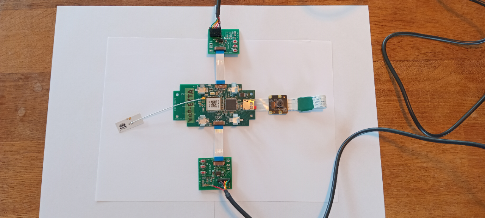
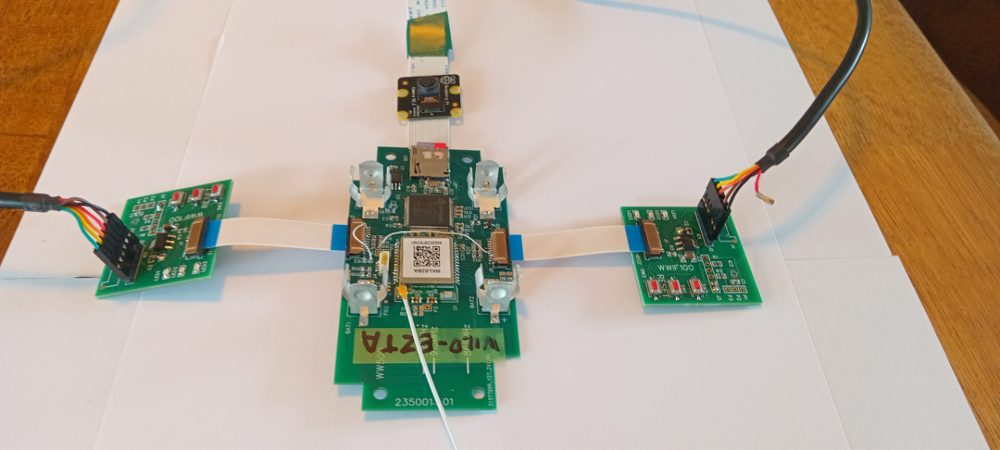
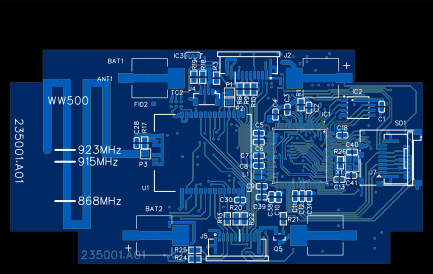
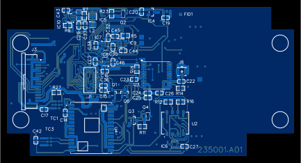

WW500 Initial Shipment
==============================================
#### CGP 6 February 2025

These notes relate to the initial batch of WW500 boards. There are 5 boards in this batch - one of which I will retain.
The other 4 are to be sent to Victor for distribution to developers. These notes are intended as a brief summary of the boards for early users.

**The hardware is delicate. Please be careful with it. Please excuse some sub-optimal behaviour as development is on-going.** 

## Getting Started Quickly
Look at these two views of the test setup:

 

The images show:
- The WW500 board
- An SD card in the socket
- A Raspberry Pi V2.1 camera plugged in
- A WWIF100 board plugged into J5 - this is the debug port for the MKL62BA (LoRaWAN and BLE comms)
- A WWIF100 board plugged into J2 - this is the debug port for the HX6538
- Two TTL-232R-3V3 USB cables which behave as serial ports to the laptop.

Because of a shortage of WWIF100 boards, you will normally use one in either J2 or J5. If you use both it is preferrable to remove
the 5V power (red) wire from the headshell of one of the cables as shown in the images. This stops both WWIF100 attempting to power the WW500.

Run Teraterm on the laptop (two instances if you are using with cables).
- On J5 the MKL62BA runs at 115200 baud
- On J2 the HX6538 runs at 921600 baud

The boards should both power on when power is applied through the USB cables. Patterns of blinking LEDs should be seen on both WWIF100 boards.
If this does not happen, try pressing the RESET button on either WWIF100.

Start the BLE advertising by one of these methods:
- Press SW1 on the J5 WWIF100
- Move a magnet adjacent to IC4 (this is on the edge of the board close to J2)

(Note that the BLE adverting will stop after 1 minute, and an established BLE connection will be dropped after 1 minute of inactvity).

Run the nRFToolbox app and select the UART sub-app. Look for the advertising device which will have a name like `WILD-JYIC` and click on this.

In the text box type `status` and expect to see a (not very meaningful!) message returned from the MKL62BA.

In the text box type `AI status` and expect to see a (not very meaningful!) message returned, this time from the HX6538.

In the text box type `AI capture 4` which s an instruction to the HX6538 to take 4 pictures.

In general, a command with a `AI ` prefix is sent to the HX6538 and is executed the same way as if it were typed at the
HX6538 console. Other commands are interpretted by the MKL62BA (which does not implement console input).

## Hardware Summary
The [WW500 schematic](images/SCH-235000.A01.pdf) shows it has two processors running independent software:

* The [MKL62BA](https://www.mokosmart.com/lorawan-module/) is a module using the Nordic Semiconductor nRF52836 processor. It provides Bluetooth (BLE) and LoRaWAN communications.
* The [HX6538](https://himaxwiseeyeplus.github.io/) processor connects to image sensors and has neural network (NN) accelerator. It supports an SD card socket.

The two processors communicate via an I2C interface. The HX6538 is the I2C slave. There is a single signal between 
the processors which acts as an (active low) bidirectional interrupt.

WW500 PCB artwork is shown here:

 
 

WW500 component layout is available as these pdf files:

* <a href="images/ASS-235002.A01-TOP.pdf" target="_blank">Top side view</a>
* <a href="images/ASS-235002.A01-BOTTOM.pdf" target="_blank">Bottom side view</a>

_NOTE_ There are a few manual changes to the hardware that are not shown on the schematic:
* Wire link from HX6538 processor PB11 to MKL62BA P18 (SW2) - this is the inter-processor interrupt signal.
* 4M7pull-down resistor added to /POWER_EN signal (processor PA1 pin for powering off volatage regulators for DPD - this is untested.)
* Lifted J2 pin 1 and added a wire link so that a WWIF100 board on J2 sources power to 3V3 instead of 3V3_WE.

## Console Interface

The WW500 has two 10-way connectors for flat flexible cables (FFC). These can connect to smaller PCBs (called WWIF100) each of which has these features:
* 6-way connector for a USB serial port cable (the FTDI TTL-232R-3V3). This cable provide a serial port for a console and a 5V power supply.
* A 5V to 3.3V voltage regulator. This means the WW500 can be power by (either, but not both) WWIF100 boards.
* Three switches
* Three LEDs (red, green blue)

Connector J2 provides the console connector for the HX6528. This uses 921600 baud.

Connector J5 provides the console connector for the MKL62BA. This uses 115200 baud.

One or both consoles can be active at once. Connect a WWIF100 to the WW500 using a 10-way FFC. Connect a FTDI TTL-232R-3V3
between the WWIF100 and a laptop computer. The J2 and J5 connectors have pin 2 removed, and FTDI TTL-232R-3V3 cables that
I provide have pin 2 (the brown wire) blocked. This ensures that the cable can plug into the WWIF100 only with the correct polarity.

It is bad practise to attempt to power any electronic circuit from more than one power source. This can potentially damage the power sources.
To ensure this does not ahppen, don't install batteries when powering the WW500 from either of the  FTDI TTL-232R-3V3 cables.
Also, if you are using both FTDI TTL-232R-3V3 cables then it is preferrable if the 5V wire (red wire, pin 3) is extracted from the 6-way socket of
one of the FTDI TTL-232R-3V3 cables.

Use a terminal emulator such as Teraterm. 

The current software implements bidirectional comms for the HX6538 (type 'help' for available commands).
The MKL62BA only provides status output messages. 

## Battery Power

The WW500 has clips for two AA cells. Polarity is marked on the PCB. (There is a polarity protection circuit that should guard against 
batteries connected the wrong way, but please avoid this).

I don't expect that the WW500 can be powered for a long time by AA batteries. These are present for historical reasons and to demonstrate
some level of battery operation. An external power source (3.3V) can be supplied via J2, J5 or J4. 

The WW500 has been designed for a buck-boost power supply circuit, that can provide a regulated 3.3V from the batteries regardless 
of whether the batteries supply more, or less, than 3.3V. However this is not implemented on the initial batch of WW500 boards.
The HX6538 and MKL62BA receive the battery voltage, whatever that may be.

Power supply switches are present on the HX6538 as documented in the Himax Application Note section 3.11.
These reove 3.3V and 1.8V power from some circuitry during deelp power down (DPD) mode. These are controlled by the PA1 pin. 
At the time of writing these swicthes have not been tested (i.e. they remain on all the time).

At the time of writing, power consumption has not been evaluated.

## MKL62BA operation

This processor boots and attempts to join a LoRaWAN network. If it succeeds it sleeps, and sends a regular 'Ping' message,
currently every 4 hours. If it fails (after 6 retries) it gives up (TODO - how to prompt a retry?).

At the time of writing all WW500 devices are registered to a ['The Things Network' (TTN)](https://www.thethingsnetwork.org/) 
LoRaWAN account managed by me. If you want to see messages being exchanged through this network then ask me for access. 
The five WW500 devices can be seen in the [Wildlife Watcher Test](https://au1.cloud.thethings.network/console/applications/wildlife-watcher-test/devices)
if you are logged in.

Currently messages are sent from the TTN server to a server of mine using a webhook integration.
A placeholder downlink message is sent. 
At the time of writing there is no significance to the uplink and downlink payloads. 

The MKL62BA can communicate to an app on a smart phone using BLE comms. Either the Wildlife Watcher app, or 
the Nordic Semiconductor [nRF Toolbox](https://play.google.com/store/apps/details?id=no.nordicsemi.android.nrftoolbox&hl=en_NZ)
 app can be used. Text messages can be exchanged between the app and the MKL62BA. usually the app sends a message, and 
 the MKL62BA replies with a response. The MKL62BA can also send unsolcited messages (mainy about LoRaWAN comms).

 Messages that begin with "AI " are forwarded to the HX6538, whch sends a reponse, via the MKL62BA.

Message syntax is described elsewhere, but try these:
* status
* id
* ver
* ping
* AI status
* AI enable
* AI disable
* AI capture 4

The switches on the MKL62BA operates as follows:
* RESET - this is not a hardware reset. If you press it, and the software is running, then it will cause a software reset when released.
  This pin is connected to the RESET pin of the HX6538, where it does cause a hardware reset.
* SW1 - pressed briefly - starts BLE advertising.
* SW1 - pressed for >5s - puts the MKL62BA into 'Device Firmware Update' (DFU) mode, which allows new firmware
to be loaded from the smart phone.
* SW1 - if pressed while the device resets - this will erase LoRaWAN credentials. **Don't do this unless you know what happens next!**
* SW2 - not to be used as a switch on the WW500. This is connected to the bidirectional interrupt signal between the 
MKL62BA  and the HX6538.

The MKL62BA also responds to a magnet adjacent to IC4. At the time of writing this trigger BLE advertising. 
If the magnet is present a reset the MKL62BA enters DFU mode. 
It also determines the state of the trap sensor - this is an artifact in the software for the REWILD predator traps. 

The LEDs on the MKL62BA perform a variety of status information. (to be documented...)
A pattern of all 3 at reset marks the reset phase. There is some blinking related to LoRaWAN communications. 
When placed in DFU mode the red and blue LEDs are on, and while the DFU is underway the red and green LEDs are on.    

## HX6538 operation

This has a command line interface (CLI) - type 'help' to see available commands.
At present the most useful command is: 'capture 4' (or some other number). This directs the HX6538
to take a number of images and save them to the SD card.

Commands available on the HX6538 can also be sent from the smart phone. When using nRF Toolbox, pre-pend `AI `
to the command. When using the Wildlife Watcher app this is done for you.

#### Camera

The WW500 does not work with the Raspberry Pi camera V1.3. This is due to the lack of a level-shifting circuit.
Use the IMX219 image sensor as provided by the Raspberry Pi V2.1 camera. Other cameras have not been tested.

## Firmware updates

#### MKL62BA
This can be done from a smart phone using DFU. The DFU feature of the nRF Toolbox app allows this. 
The DFU mode can be entered by several means:
* Press SW1 for >5s
* Hold a magnet adjacent to IC4 and reset the board (power-on or switch).
* From the app, type "dfu" then disconnect the BLE connection.

When in DFU mode the red and blue LEDs are on. Use the RF Toolbox app, DFU sub-app. Select an image ( a .zip file)
then select the "WW500_DFU" device, then begn the download. The LEDs change to to red and green while this is happening.

If the device is in DFU mode for 2 minutes without the transfer beginning, it exits and start execute of the main code.

#### HX6538

This is done using the console and XMODEM transfer. 

Press any key on the keyboard, then press and release the RESET button. Then using Teraterm,
transfer a new image to the HX6538.

The process of generating the image files is described in the `Compile_and_flash.md' document.

Changing the bootloader requires the use of an SWD programmer. The SWD pins are available at the TC1 site on the back of the PCB.
This is designed for a [TC2030](https://www.tag-connect.com/product/tc2030-idc-nl) adapter.
(Maybe the I2C port can be used? I have not tried this. The I2C signals are available on J4. 
Normally the MKL62BA drives these signals.)

## Untested Circuitry

* Use of PA0 and PA1 for deep-power-down control
* HM0360 socket and interface signals (see schematic).
* 3.3V buck-boot voltage regulator

These components are not populated:
* Radar module
* GPS module
* Accelerometer

(Note to self: [Markdown Guide](https://confluence.atlassian.com/bitbucketserver083/markdown-syntax-guide-1155483368.html))