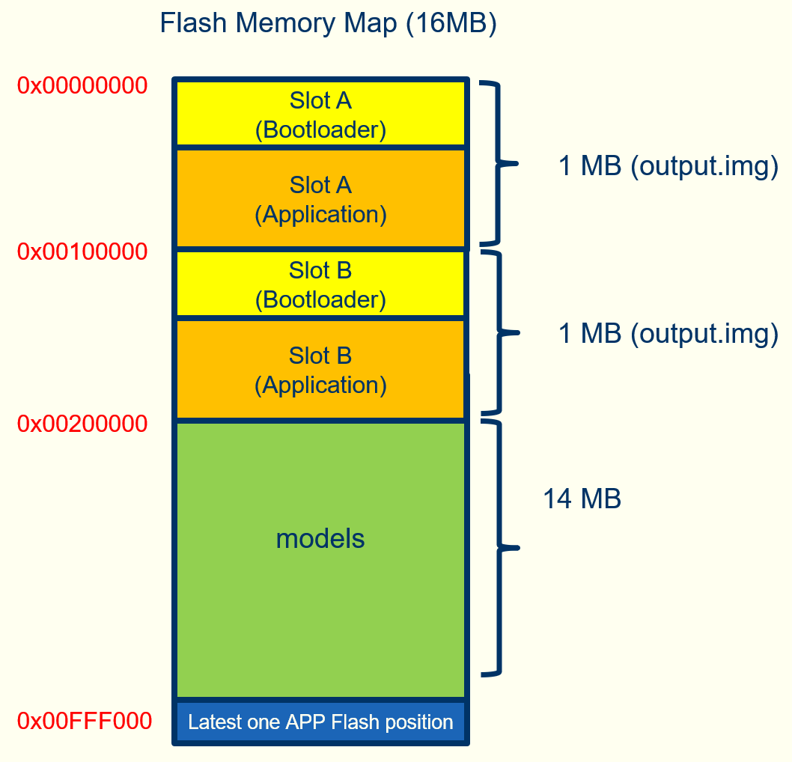

# HX6538 Bootloader
#### Notes emailed from Himax 17/1/25


1. The HX6538 flash memory map is as follows. We support dual slots to store two firmware 
images to avoid firmware upgrade failure via Xmodem.
2. Initially, the flash memory is empty and we have to program the first firmware image 
(including the bootloader and application) into the flash memory via I2C or SWD.
3. `we2_image_gen_local` or `we2_image_gen_local_dpd` are firmware image generation tools. 
The difference is that I put the dpd mode bootloader in we2_image_gen_local_dpd.

When you want to generate the firmware with dpd mode bootloader, the operation procedure is the same as when you use 
`we2_image_gen_local`. Copy our application elf file into input folder and execute `./we2_local_image_gen` command.
```
copy ..\EPII_CM55M_APP_S\obj_epii_evb_icv30_bdv10\gnu_epii_evb_WLCSP65\EPII_CM55M_gnu_epii_evb_WLCSP65_s.elf input_case1_secboot
we2_local_image_gen project_case1_blp_wlcsp_rc24m.json
```
This “output.img” file contains the bootloader and the application:

`D:\Development\wildlife.ai\Seeed_Grove_Vision_AI_Module_V2\we2_image_gen_local_dpd\output_case1_sec_wlcsp\output.img`


4. When you progra `output.img` into the flash via SWD, the bootloader and application are written into the 
flash concurrently.
5. When programming `output.img` into flash via SWD, the bootloader and application will be written into 
flash Slot A at the same time. Restart HX6538. The bootloader and application of Slot A will be executed 
immediately. There is no need to upload the application again via Xmodem.

6. If the firmware is upgraded via Xmodem, the application will be written to slot B and the application boot 
index will be updated in flash address 0x00FFF000. _The bootloader will not be updated._
Restart HX6538, the bootloader will check the application startup index (0x00FFF000) to start the application in Slot B.
If you upgrade the firmware again with Xmodem, the application will be written to slot A and the application 
startup index will be updated in the flash address 0x00FFF000.
You can see the bootloader output message "slot flash_offset 0x00000000" or "slot flash_offset 0x00100000", 
which means Slot A or Slot B application is running.

7. When you burn `output.img` into flash via SWD, the latest application is in slot A, but if the 
"application startup Index" points to slot B the application in slot B will be executed.
You may wonder why the application in Slot A is not executed. Therefore it is recommended to erase the 
last 4K block of the flash memory before programming "output.img" to the flash memory via SWD.
```
python swdflash.py --bin="4k_dummy0xFF.img" --addr=0x00fff000
```
4k_dummy0xFF.img is a 4K file with all contents being 0xFF.





 
