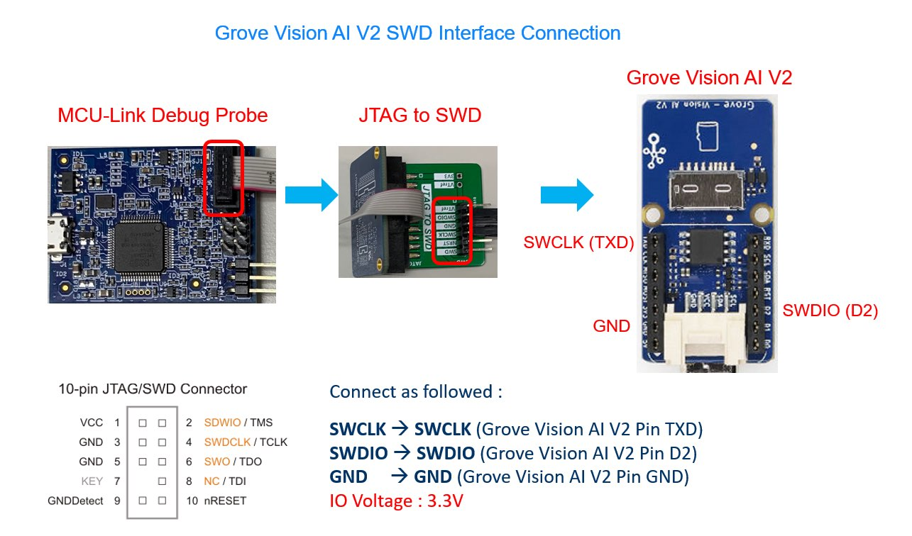
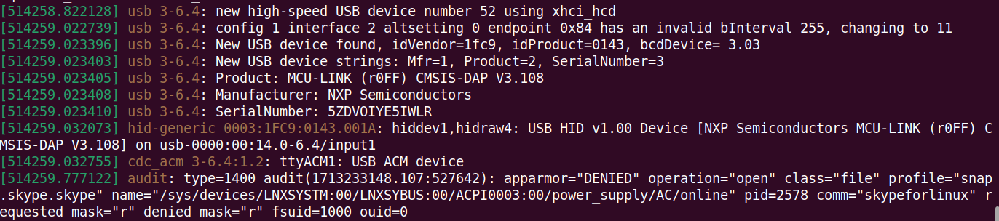
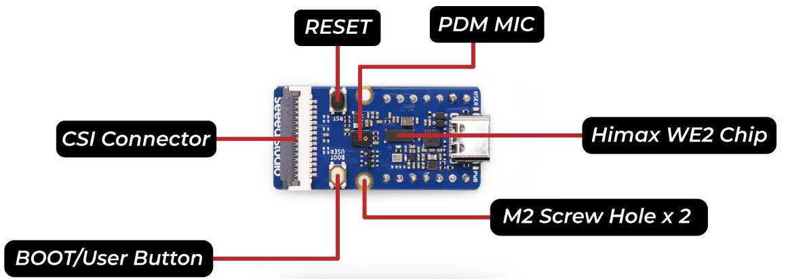
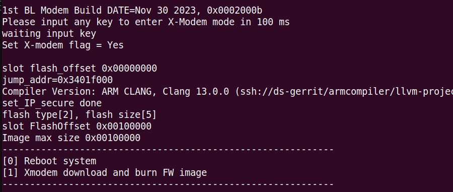
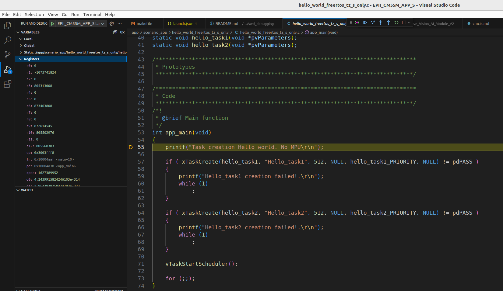
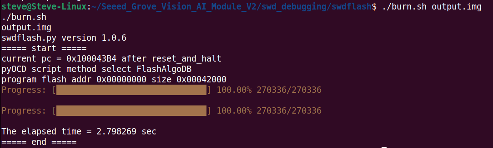

# How to debug a program in VS Code using SWD Interface?

## Requirements
- System requirement   : Ubuntu 20.04.6 LTS
- Hardware requirement : CMSIS-DAP Compatible Debugger (https://pyocd.io/docs/debug_probes.html)
    

## Installation
1. Install VS Code (https://code.visualstudio.com/download) 

###
2. Install VS Code Extension
    ```
    code --install-extension marus25.cortex-debug
    code --install-extension ms-vscode.cpptools
    code --install-extension dan-c-underwood.arm
    code --install-extension ZixuanWang.linkerscript
    code --install-extension trond-snekvik.gnu-mapfiles
    ```

###
3. Install pyOCD for WE2
   Uninstall pyOCD and reinstall pyocd_hx-0.34.3.dev0+dirty
    ```
    cd pyocd
    python3 -m pip uninstall pyocd
    python3 -m pip uninstall pyocd_hx
    python3 -m pip install pyocd_hx-0.34.3.dev0+dirty-py3-none-any.whl
    ```
    Add udev rules into /etc/udev/rules.d
    ```
    sudo cp ./udev/*.rules /etc/udev/rules.d
    ```
    If you use different, but compatible, debug probe from one of those listed above, you can check the IDs with the dmesg command.
    - Run dmesg
    ```
    sudo dmesg
    ```
    - Plug in your Debugger board and run dmesg again and check what was added
    ```
    sudo dmesg
    ```
    - Look for line similar to usb 3-6.4: New USB device found, idVendor=1fc9, idProduct=0143, bcdDevice= 3.03
    
  
    - To see your changes without a reboot, you can force the udev system to reload:
    ```
    sudo udevadm control --reload
    sudo udevadm trigger
    ```

###
4. Setup VS Code toolchain and source path
   - Edit EPII_CM55M_APP_S/.vscode/tasks.json
     - Replace toolchain path "/toolchain/arm-gnu-toolchain-13.2.Rel1-x86_64-arm-none-eabi" to your toolchain path
     - Replace source code path "/home/steve/Seeed_Grove_Vision_AI_Module_V2/EPII_CM55M_APP_S" to your source path
   - Edit EPII_CM55M_APP_S/.vscode/settings.json
     - Replace toolchain path "/toolchain/arm-gnu-toolchain-13.2.Rel1-x86_64-arm-none-eabi" to your toolchain path
     - Replace source code path "/home/steve/Seeed_Grove_Vision_AI_Module_V2/EPII_CM55M_APP_S" to your source path
   - Edit EPII_CM55M_APP_S/.vscode/launch.json
     - Replace toolchain path "/toolchain/arm-gnu-toolchain-13.2.Rel1-x86_64-arm-none-eabi" to your toolchain path
     - Replace source code path "/home/steve/Seeed_Grove_Vision_AI_Module_V2/EPII_CM55M_APP_S" to your source path
     - Replace server path "/home/steve/.local/bin/pyocd" to your pyocd path

###
5. Build elf in VS Code
    - Launch VS Code and open EPII_CM55M_APP_S source folder
    - Terminal -> Run Task
    - Select “clean build” to clean previous built elf and then build or “build” only build updated files into elf

###
6. Force Seeed Grove Vision AI Module V2 in debugging mode without running application in flash
    - Plug in Seeed Grove Vision AI Module V2
    - Open Minicom, setup serial port and COM Port name-> connect to Grove Vision AI Module V2. (Please reference https://github.com/HimaxWiseEyePlus/Seeed_Grove_Vision_AI_Module_V2/blob/main/README.md)
    - Hold down any key on the keyboard (except the Enter key) and press the reset button to reset Grove Vision AI Module V2 and the startup options will be displayed.
    
    
    - Do not enter [0] or [1], just stop here.

###
7. In VS Code, switch to “run and debug” section
    - Select EPII_CM55M_APP_S Launch - elf will be loaded to WE2 and start debugging after press “start debugging(F5)”
    - The program will be stopped at "runToEntryPoint": "app_main" then you can debug step by step.
    

    - Troubleshooting for ubuntu linux
      - error while loading shared libraries: "libncurses.so.5: cannot open shared object file: No such file or directory"
      ```
      sudo apt-get install libncurses5
      ```

      - error while loading shared libraries: "libncursesw.so.5: cannot open shared object file: No such file or directory"
      ```
      sudo apt-get install libncursesw5
      sudo apt-get install libtinfo5
      ```

# Flash programming by SWD
1. Compile the firmware
    ```
    cd EPII_CM55M_APP_S
    make clean
    make
    ```
- Output elf file: `./obj_epii_evb_icv30_bdv10/gnu_epii_evb_WLCSP65/EPII_CM55M_gnu_epii_evb_WLCSP65_s.elf`
    
2. Generate firmware image file
    ```
    cd ../we2_image_gen_local/
    cp ../EPII_CM55M_APP_S/obj_epii_evb_icv30_bdv10/gnu_epii_evb_WLCSP65/EPII_CM55M_gnu_epii_evb_WLCSP65_s.elf input_case1_secboot/
    ./we2_local_image_gen project_case1_blp_wlcsp.json
    ```
- Output firmware image: `./output_case1_sec_wlcsp/output.img`
    

3. Copy output.img to "/swd_debugging/swdflash" folder and program flash
    ```
    cd ../swd_debugging/swdflash/
    cp ../../we2_image_gen_local/output_case1_sec_wlcsp/output.img .
    ./burn.sh output.img
    ```
    
